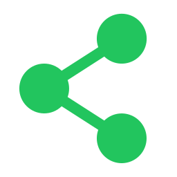

<div align="center">

<h1>
  
  V-NOC
</h1>

### The Graph-Based IDE

*Software development is a computational problem that we have mistakenly turned into a memory problem.*

[](https://opensource.org/licenses/Apache-2.0)
[](https://discord.gg/J5nfPHqyBr)
[](https://www.python.org/)
[](https://terminusdb.com/)

</div>

---

V-NOC replaces the archaic file-and-folder system with a **logic graph**, moving the burden of *connecting the dots* from the human brain to the computer. Code, calls, dependencies, logs, tests, documentation, and version history all live as **nodes and edges in a single, queryable graph** — backed by [TerminusDB](https://terminusdb.com/), a graph database with built-in Git-style version control.


> **TL;DR** — Stop reading files. Read the graph. The computer does the linking; you do the thinking.

---

## Table of Contents

- [Why V-NOC](#why-v-noc)
- [What's Inside](#whats-inside)
- [Quick Start](#quick-start)
- [Creating a Project](#creating-a-project)
- [Supported Languages](#supported-languages)
- [Walkthrough Agent](#walkthrough-agent)
- [Service Ports](#service-ports)
- [Documentation](#documentation)
- [Community & License](#community--license)

---

## Why V-NOC

Modern software is built around files and folders. Files are not real structures — they are *storage artefacts*. They do not describe behaviour, relationships, or intent. They only make sense after a human opens them, runs the code, and mentally reconstructs how everything fits together.

V-NOC flips this:

- **The code is the database.** Functions, classes, files and folders are nodes; calls, imports, and dependencies are edges.
- **Hierarchical context is automatic.** Logs follow the call graph. Tests follow the function under test. Docs follow the symbol they describe.
- **AI agents query the graph, not the filesystem.** They cannot hallucinate edges that do not exist; their work is auditable.
- **Version control is first-class graph data.** Branches, commits, diffs and remotes live next to the code itself, powered by TerminusDB.

For the long-form philosophy, see **[doc/01-vision.md](doc/01-vision.md)**.


---

## What's Inside

| Component | Path | Stack |
|---|---|---|
| Backend API (REST + JSON-RPC) | `src/backend/` | FastAPI, Python 3.12, TerminusDB |
| Walkthrough agent | `src/backend/app/walkthrough/` | LangGraph, LangChain, OpenAI-compatible LLMs |
| Frontend (canvas IDE) | `src/frontend/` | React, Vite, TypeScript |
| Python language driver | `src/lsp/py/` | Jedi, LibCST, FastAPI JSON-RPC |
| TS/JS language driver | `src/lsp/ts_js/` | Bun, ts-morph, Hono |
| Structured logger SDK | `src/vn_logger/` | Python decorator library |
| Graph database | Docker / Compose | TerminusDB + Vectorlink |

Architecture overview: **[doc/02-architecture.md](doc/02-architecture.md)**.

---

## Quick Start

### Prerequisites

- **Python** 3.12+ with [`uv`](https://github.com/astral-sh/uv)
- **Node.js** 18+ with **Yarn**
- **Bun** 1.2+ (for the TS/JS language driver)
- **Docker** + Docker Compose (for TerminusDB)

### 1. Install

```bash
uv venv
make install         # backend + frontend
make install-lsp     # Python + TS/JS language drivers
```

### 2. Configure

```bash
cp src/backend/.env.example src/backend/.env
```

Edit `src/backend/.env` if you want non-default ports, a different TerminusDB password, or a real LLM for the walkthrough agent (see [Walkthrough Agent](#walkthrough-agent)).

### 3. Run

```bash
make start-db        # TerminusDB → http://localhost:6363
make dev             # Backend (8000) + JSON-RPC (8050) + Frontend (5173)
```

Open **http://localhost:5173** and you're in.

> Use `make help` to see every available command, grouped by purpose.

Full walkthrough: **[doc/03-getting-started.md](doc/03-getting-started.md)**.

---

## Creating a Project

V-NOC is web-based but operates on **local source trees**. Because the browser cannot see your filesystem directly, you tell the backend where your code lives by supplying an absolute path.

From the frontend, open **New Project** and fill in:

| Field | Description |
|---|---|
| **Name** | Display name in V-NOC (≥ 3 characters) |
| **Description** | Optional |
| **Path** | **Absolute path** on the host running the backend (e.g. `/Users/me/code/my-app`) |
| **Remote mode** | `none` (local only), `create_remote` (bootstrap a TerminusDB remote), or `clone` (full clone from a remote URL) |

Equivalent REST call:

```bash
curl -X POST http://localhost:8000/api/v1/projects/ \
  -H 'Content-Type: application/json' \
  -d '{
        "name": "my-app",
        "description": "Backend service",
        "path": "/Users/me/code/my-app",
        "remote_mode": "none"
      }'
```

On creation, V-NOC:

1. Walks the path, parsing each supported source file through the appropriate language driver.
2. Builds the graph (files → classes → functions → calls → MRO chains).
3. Injects stable IDs as docstring/comment markers so logs, tests, playgrounds, and documents can attach to symbols even as the code changes.
4. Starts a watcher that keeps the graph in sync with the filesystem.

Full guide, including remote bootstrap and clone: **[doc/04-creating-a-project.md](doc/04-creating-a-project.md)**.

---

## Supported Languages

V-NOC parses source through **language drivers** — small, language-specific JSON-RPC services that share a common protocol. This keeps the graph builder language-agnostic and lets new languages plug in without backend changes.

| Language | Driver | Default port | Engine |
|---|---|---|---|
| Python | `src/lsp/py/`  → `make run-lsp-python` | `9002` | Jedi + LibCST |
| TypeScript / JavaScript | `src/lsp/ts_js/` → `make run-lsp-ts` | `9001` | ts-morph (Bun) |

Start both at once:

```bash
make run-lsp
```

Driver protocol and how to add a new language: **[doc/05-language-drivers.md](doc/05-language-drivers.md)**.

---

## Walkthrough Agent

The walkthrough agent generates an AI-guided tour of your call graph — intro, block plan, and per-block explanations — streamed from the backend while the canvas highlights each stop.

**Default:** `WALKTHROUGH_LLM=fake` needs no API key and returns deterministic placeholder copy (good for local dev and tests).

**Real LLM:** set one line in `src/backend/.env` and restart the backend:

| Goal | `.env` |
|---|---|
| OpenAI | `WALKTHROUGH_LLM=openai:gpt-4o-mini` + `OPENAI_API_KEY=sk-...` |
| Vercel AI Gateway | `WALKTHROUGH_LLM=vercel:zai/glm-4.7` + `AI_GATEWAY_API_KEY=...` |
| Local / OpenRouter / vLLM | `WALKTHROUGH_LLM=custom:your-model` + `CUSTOM_LLM_BASE_URL=...` + `CUSTOM_LLM_API_KEY=...` |

`OPENAI_API_KEY` is also used by Vectorlink for semantic search embeddings when the database stack is running.

**Optional tracing:** set `LANGSMITH_API_KEY` (and optionally `LANGSMITH_PROJECT`) to send LangGraph runs to [LangSmith](https://smith.langchain.com/).

**API:** `GET /api/v1/walkthroughs/models` lists providers and curated models; `POST /api/v1/walkthroughs/run` starts a tour (NDJSON stream). In the UI, open the Agent panel on a function or class node and choose **Generate walkthrough**.

Full design notes: **[plan/walkthrough-agent/](plan/walkthrough-agent/)**.

---

## Service Ports

| Service | URL | Override |
|---|---|---|
| Frontend (Vite) | `http://localhost:5173` | `FRONTEND_PORT` |
| Backend REST API | `http://localhost:8000` | `BACKEND_PORT` |
| Backend JSON-RPC | `http://localhost:8050/api/v1/jsonrpc` | `RPC_PORT` |
| Python LSP driver | `http://127.0.0.1:9002/rpc` | `LSP_PY_PORT` |
| TS/JS LSP driver | `http://127.0.0.1:9001/rpc` | `LSP_TS_PORT` |
| TerminusDB | `http://localhost:6363` | `TERMINUS_PORT` |
| Vectorlink (semantic index) | `http://localhost:8080` | — |

Every port is overridable inline:

```bash
make run-backend BACKEND_PORT=9000
```

---

## Documentation

The `doc/` folder is organised top-down, from **why** to **how**. Each domain lives in its own file so you can dive into exactly what you need.

| # | Document | What it covers |
|---|---|---|
| 01 | [Vision](doc/01-vision.md) | Philosophy, the file-system problem, the graph thesis |
| 02 | [Architecture](doc/02-architecture.md) | Components, data flow, the boundary map |
| 03 | [Getting Started](doc/03-getting-started.md) | Install, configure, run |
| 04 | [Creating a Project](doc/04-creating-a-project.md) | Local paths, remote bootstrap, cloning |
| 05 | [Language Drivers](doc/05-language-drivers.md) | Driver protocol, adding a language, ports |
| 06 | [Function & Class Tracking](doc/06-function-class-tracking.md) | ID injection, stable identity across edits |
| 07 | [Logs](doc/07-logs.md) | `vn-logger`, the execution-tree view |
| 08 | [Playground](doc/08-playground.md) | Sandboxed code-runs scoped to graph nodes |
| 09 | [Test Tracking](doc/09-test-tracking.md) | Linking tests to symbols, runs, and results |
| 10 | [Version Control (TerminusDB)](doc/10-version-control.md) | Branches, commits, diffs, remotes |
| 11 | [Makefile Reference](doc/11-makefile-reference.md) | Every target, every variable |

---

## Project Vision & Roadmap

The tools used in this project were chosen for speed and simplicity, allowing ideas to be prototyped, tested, and shipped quickly. Much of the system is experimental by design.

> [!NOTE]
> If the project gains enough traction and community support, critical components — especially the sync pipeline — will be migrated to **Rust**. That pipeline must be smooth, reliable, and frictionless for developers.

Several performance bottlenecks have already been identified (notably in the call-chain builder) and are being addressed iteratively.

---

## Community & License

V-NOC is licensed under the **Apache License 1.0** — free for personal, commercial, and production use. Modification and redistribution are permitted under the terms of the license. See `LICENSE` for the full text.

- **Discord:** https://discord.gg/J5nfPHqyBr
- **Issues & contributions:** PRs and bug reports welcome. Start a thread on Discord if you'd like to discuss before opening a PR.
