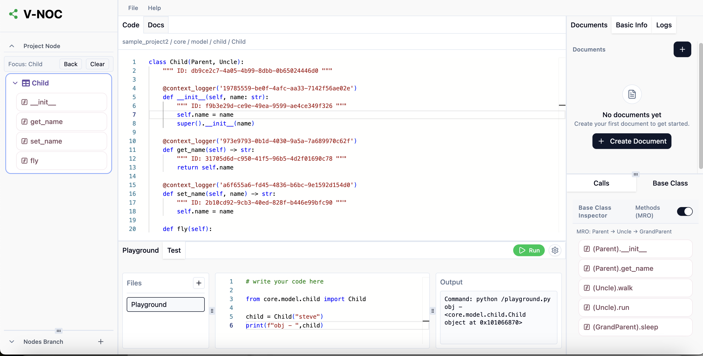

# 01 · Vision

> *Software development is a computational problem that we have mistakenly turned into a memory problem.*

V-NOC is a new kind of coding environment. It replaces the archaic file-and-folder system with a **logic graph**, moving the burden of *connecting the dots* from the human brain to the computer.

---

## The Problem: Software Built Like Origami

Programming is not hard because real-world logic is complicated. It is hard because our tools separate code from the real world it represents.

Modern software is built around files and folders. Files are not real structures; they are storage artefacts. They do not describe behaviour, relationships, or intent. They only make sense after a human opens them, runs the code, and mentally reconstructs how everything fits together. As a result, most codebases are disorganised by default and rely on developers to supply the missing structure in their heads.

This creates a growing gap between real-world logic and how it is represented in code. A simple business rule can be easy to explain in plain language, but hard to implement because it must be spread across many files, layers, and abstractions. The logic itself is not complex; the mental model required to *locate* and *connect* it is.

> [!IMPORTANT]
> **The Mental Model Debt**
>
> When you open a project, you do not see how the system works. You only see where files are stored. This creates "mental model debt." Every feature, workaround, and abstraction adds invisible complexity that lives only in people's heads. So-called "AI IDEs" try to solve this with chat interfaces, but that only hides the problem.

This hidden complexity is one of the main reasons programming tasks are so hard to estimate. The real-world change may be small and well understood, but the effort required to navigate, verify, and safely modify the existing mental model is unknown. As projects grow, this cost grows faster than the code itself.

- **Unwrap the origami:** dig through folders, layers, and abstractions just to find where the real logic lives.
- **Act as the human linker:** manually trace function calls, search logs, and hunt for documentation because the tools do not understand relationships.
- **Compile the system in your head:** hold a large mental map of the codebase just to safely change a single line.

In practice, we spend far more time understanding structure than writing code.

---

## The Philosophy: Programming Like Google Maps

Today's programming systems are so difficult to navigate that they create artificial hierarchies: junior, senior, staff, principal. Much of this distinction is not about solving real-world problems, but about memorising codebases and managing hidden complexity.

Computers were built to reduce complexity, not to create it. If a computer can trace an execution path, a human should never have to. Simplicity is what scales, and simplicity is what makes software accessible to more people.

### 1. From memory problem to computational problem

Programming comes from mathematics, and math never expects you to understand everything at once. The core technique in mathematics is **decomposition**: break a problem into smaller, well-defined parts, solve each part independently, then compose the result.

We already know these principles:

- Factorisation instead of expanding everything
- Functions with clear inputs and outputs
- Local reasoning before global reasoning
- Proofs built from small lemmas, not one giant argument

A graph-based structure makes this natural. Dependencies, data flow, and control flow are explicit. You can "slice" the system the same way you slice a math problem: one node, one neighbourhood, one level at a time.

### 2. Killing the "side quest"

In traditional IDEs, getting information always turns into a side quest.

- **Need logs?** Scroll through terminals or third-party dashboards.
- **Need documentation?** Switch to a browser.
- **Need the call stack?** Set breakpoints and trigger a debugger.

In V-NOC, this information is already connected. Logs, documentation, execution paths, and code belong to the same node. You do not search for context — the computer does that for you and presents it where it is needed.

### 3. Canvas over chat: verify, don't trust

English is becoming a way to program, but a chat box is the wrong interface for it. No one should have to trust a 100-message log to feel confident about a code change.

In V-NOC, agents do not hide behind text. They operate on a **canvas**. Instead of reading explanations, you see an animated walkthrough of the changes: what was touched, why, and how it affects the system. Structure, dependencies, and impact are visible, not implied.

It is like Google Maps for your codebase. You give directions in words, but the system responds with a visual map. You can see the path, zoom in, zoom out, and verify every step.

### 4. Flexibility over rigidity

Graphs are flexible by nature. V-NOC lets you view and work on your project based on what you need at the moment — a high-level system overview or a deep dive into a single execution path — without moving or restructuring files.

This is similar to how hardware is repaired: if the power supply fails, you fix the power supply. You don't need to understand the motherboard or RAM. V-NOC applies the same principle to software.

---

## The Solution: A Living Knowledge Graph

Instead of a file tree, the core of V-NOC is an **interactive, multidimensional map**.

- **The code is the database.** Your project is stored as nodes (functions, classes, files, folders) and edges (calls, imports, dependencies, MRO).
- **Hierarchical context.** Logs follow the code's call graph. Tests follow the function under test. Docs follow the symbol they describe.
- **Versioning is graph-native.** Branches, commits, diffs, and remotes are TerminusDB primitives, not bolted-on metadata. See `10-version-control.md`.
- **The AI superpower.** We give AI agents the structured context they need. They don't guess; they query the graph, making their work easy to audit.

---

## The Goal

Make programming **fun and clear again**. If you can read a map, you should be able to read code. V-NOC isn't about hiding the details; it's about simplifying the organisation so the details actually make sense.

Next: [02 · Architecture](02-architecture.md).
