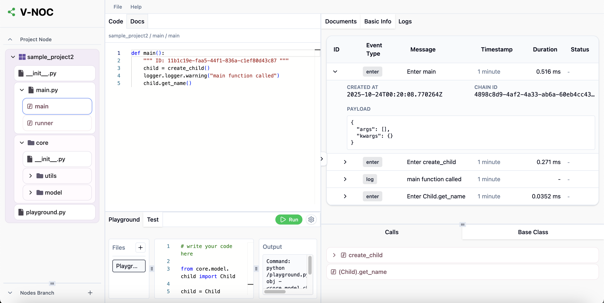

# 07 · Logs

V-NOC logs are not flat lines. They are **execution trees** — every event knows its parent, its chain, the function it came from, and the call path that produced it. On the canvas, logs appear *on the node that produced them*.

This is delivered by **[`vn-logger`](../src/vn_logger/)**, a small Python decorator library you add to the project you're observing.



---

## The mental model

A traditional log line tells you *what* happened. A V-NOC log line tells you:

- **What** happened (level, message, args, return value)
- **Where** in code (function ID — the same ID you saw in `06-function-class-tracking.md`)
- **Why** it ran (parent function ID)
- **Who else** ran with it (chain ID — the whole request / execution)
- **How long** it took (duration)

Stitch them together and you get a tree:

```
chain 6a8…
└── handle_request   (fn 7b1…)
    ├── load_user    (fn 9cd…)   12 ms
    └── render       (fn ab2…)
        └── format   (fn 3ef…)   2 ms  ← raised ValueError
```

The canvas renders that tree next to the call graph, so a failing leaf is visually attached to the function that owns it.

---

## Installing `vn-logger`

`vn-logger` is shipped as part of this repo. Install it into the project you want to observe:

```bash
# from this repo
cd /path/to/your/project
pip install -e /path/to/v-noc/src/vn_logger
```

It is a normal Python package; once published you'll be able to `pip install vn-logger`.

---

## 1. Configure once

In your application's startup path:

```python
from vn_logger import configure_logger

configure_logger(
    "http://localhost:8050/api/v1/jsonrpc",  # V-NOC JSON-RPC endpoint
    "your-project-id",                       # V-NOC project ID
)
```

Two arguments:

- The **JSON-RPC endpoint** of the backend running your V-NOC instance (`RPC_PORT`, default `8050`).
- The **project ID** you saw on the canvas when you created the project (see `04-creating-a-project.md`).

---

## 2. Decorate the functions you care about

Apply `@context_logger` to any function you want to monitor. You **must** supply a `function_id` — that's the UUID V-NOC injected into the function's docstring (`06-function-class-tracking.md`):

```python
from vn_logger import context_logger

@context_logger(function_id="7b1d9c8e-23a8-4f64-8b2a-9d6cf5b95812")
def my_function(arg1, arg2):
    """ ID: 7b1d9c8e-23a8-4f64-8b2a-9d6cf5b95812 """
    # your code
    return arg1 + arg2

my_function("a", "b")
```

The decorator automatically captures:

- Function entry and exit
- Arguments and return values
- Execution duration
- Unhandled exceptions (full stack trace)
- A `chain_id` to trace a sequence of calls
- The `parent_function_id` to build the hierarchy

You don't have to log anything by hand — the decorator does it. Add `loguru`-style structured fields when you want extra context, and `vn-logger` ships them with the event.

---

## 3. View on the canvas

In V-NOC, select a function node and open the **Logs** tab. You'll see:

- The full execution tree (chain) the call belongs to
- Per-call duration, args, return value
- Errors highlighted at the leaf where they were raised, with the chain showing the path that got there

The REST endpoint behind the panel is `GET /api/v1/logs/log-tree` (`src/backend/app/api/v1/logger_routes.py`).

---

## Why this design

- **No grep.** Logs already know what node they belong to. The graph does the joining.
- **No correlation IDs to remember.** `chain_id` and `parent_function_id` are propagated automatically through Python contextvars.
- **Auditable.** Agents looking at "what happened?" walk the same tree you do.

---

## Limits today

- Python only (matching the Python language driver). A TS/JS logger is on the roadmap.
- Decorator-based — sources you don't control can't be observed without wrapping.
- Synchronous and async functions are both supported.

Next: [08 · Playground](08-playground.md).
