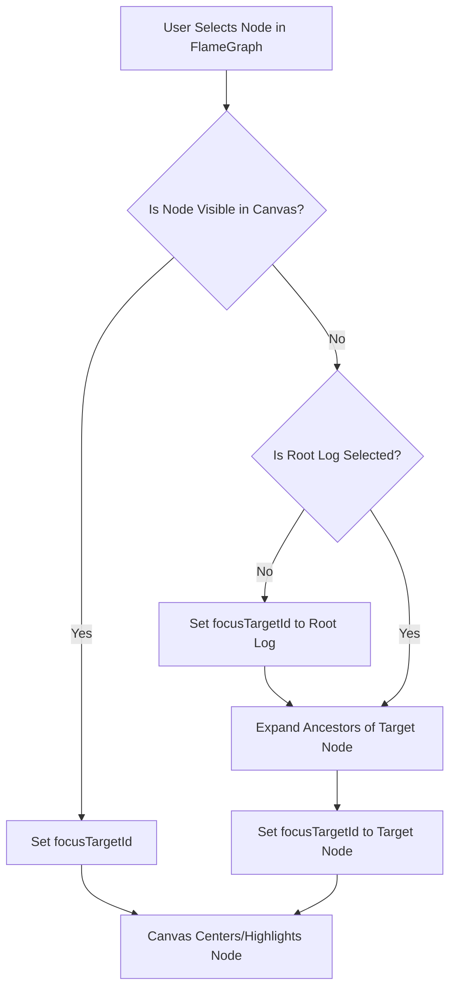

# Implementation Plan: Flame Graph Selection Sync

## Goal
Synchronize the Flame Graph selection in the Logs panel with the main Canvas view. When a node is selected in the Flame Graph, it should be revealed and focused in the Canvas, expanding necessary parent nodes if they are collapsed.

## Proposed Logic



## Changes

### 1. `src/features/Dashboard/utils/treeUtils.ts` (Update)
Add `findNodeByFunctionId` to find a node (or CallNode target) matching a function ID within a tree.

```typescript
export const findNodeByFunctionId = (root: AnyNodeTree, targetFunctionId: string): AnyNodeTree | null => {
  // Check current node
  if (root._id === targetFunctionId) return root;
  if (root.node_type === 'call' && (root as CallNodeTree).target?._id === targetFunctionId) return root;

  // Check children
  if (root.children) {
    for (const child of root.children) {
      const found = findNodeByFunctionId(child, targetFunctionId);
      if (found) return found;
    }
  }
  return null;
};

export const findPathToNode = (root: AnyNodeTree, targetId: string, path: string[] = []): string[] | null => {
  if (root._id === targetId) return path;
  if (root.children) {
    for (const child of root.children) {
      const result = findPathToNode(child, targetId, [...path, root._id]);
      if (result) return result;
    }
  }
  return null;
};
```

### 2. `src/frontend/src/features/Dashboard/store/slices/focusSlice.ts` (Update)
Add `focusTargetId` to state.

```typescript
export interface FocusSlice {
  // ... existing
  focusTargetId: string | null;
  setFocusTargetId: (id: string | null) => void;
}

// ... in createFocusSlice
  focusTargetId: null,
  setFocusTargetId: (id) => set({ focusTargetId: id }),
```

### 3. `src/frontend/src/features/Dashboard/features/Main/components/Sandbox/features/Logs/hooks/useNodeRevealer.ts` (New)
Create a custom hook to handle the reveal logic.

- **Dependencies**: `useProjectStore`
- **Output**: `revealNode(nodeId: string, logRootId: string)` function.

```typescript
// Pseudo-code
const revealNode = (targetLogNode: LogNode, rootLogNode: LogNode) => {
  const { selectedNode, expandedNodeIds, toggleNodeExpansion, setFocusTargetId } = useProjectStore.getState();
  
  if (!selectedNode || !targetLogNode.function_id) return;

  // User logic: "if selected id == root log.function id"
  if (selectedNode._id !== rootLogNode.function_id) {
     // Scenario: User is looking at a different tree than the log trace. 
     // Requirement: "do not change the selected node" -> So we might stop here or try to find it anyway?
     // User: "if not, do not set it" implying we fallback or abort?
     // But later: "check selected node children to find the node".
     // We will strictly search ONLY if selectedNode matches root log context, to avoid false positives in wrong trees.
     // OR we search in the current selectedNode regardless, assuming user wants to find it IF it exists here.
     // Let's search in `selectedNode` scope.
  }
  
  // Find node in the CURRENTLY SELECTED tree (selectedNode + children)
  // that matches the target log's function_id
  const targetCanvasNode = findNodeByFunctionId(selectedNode, targetLogNode.function_id);
  
  if (!targetCanvasNode) return; // Not found in this tree

  // Found it! Now ensure it is visible.
  const path = findPathToNode(selectedNode, targetCanvasNode._id);
  if (!path) return;
  
  // "do not add it directly all the parent node must be expanded also"
  // path includes all ancestors from selectedNode down to target.
  const missingExpansions = path.filter(id => !expandedNodeIds.includes(id));
  
  missingExpansions.forEach(id => toggleNodeExpansion(id));
  
  // Set focus
  setFocusTargetId(targetCanvasNode._id);
};
```

### 4. `src/frontend/src/features/Dashboard/features/Main/components/Canvas/components/CanvasView.tsx` (Update)
Listen to `focusTargetId` and center view.

```typescript
  const focusTargetId = useProjectStore((s) => s.focusTargetId);
  // We need access to the internal nodes state of React Flow (or our mapped nodes)
  // CanvasView calculates `nodes` from `useEnhancedTreeLayout`.
  
  useEffect(() => {
    if (focusTargetId && nodes.length > 0 && reactFlowInstanceRef.current) {
      const rfNode = nodes.find((n) => n.id === focusTargetId);
      
      if (rfNode) {
          reactFlowInstanceRef.current.setCenter(
            rfNode.position.x + (rfNode.measured?.width || 0) / 2,
            rfNode.position.y + (rfNode.measured?.height || 0) / 2,
            {
              zoom: 1,
              duration: 300,
            }
          );
          // Optional: We might want to clear focusTargetId after centering?
          // or keep it to show highlight?
          // User: "just set the focus id"
      }
    }
  }, [focusTargetId, nodes]); // Depend on nodes to retry if they update (e.g. after expansion)
```

## Step-by-Step Plan

1.  **Create Utility**: Implement `findPathToNode` in `src/features/Dashboard/utils/treeUtils.ts`.
2.  **Create Hook**: Implement `useNodeRevealer` in `src/frontend/src/features/Dashboard/features/Main/components/Sandbox/features/Logs/hooks/useNodeRevealer.ts`.
3.  **Integrate**: Update `LogsContainer` in `src/frontend/src/features/Dashboard/features/Main/components/Sandbox/features/Logs/index.tsx` to use the hook.
4.  **Update Canvas**: Modify `CanvasView.tsx` to react to `focusTargetId` changes.
5.  **Verify**: Test by collapsing nodes in Canvas and selecting deep nodes in Flame Graph.
