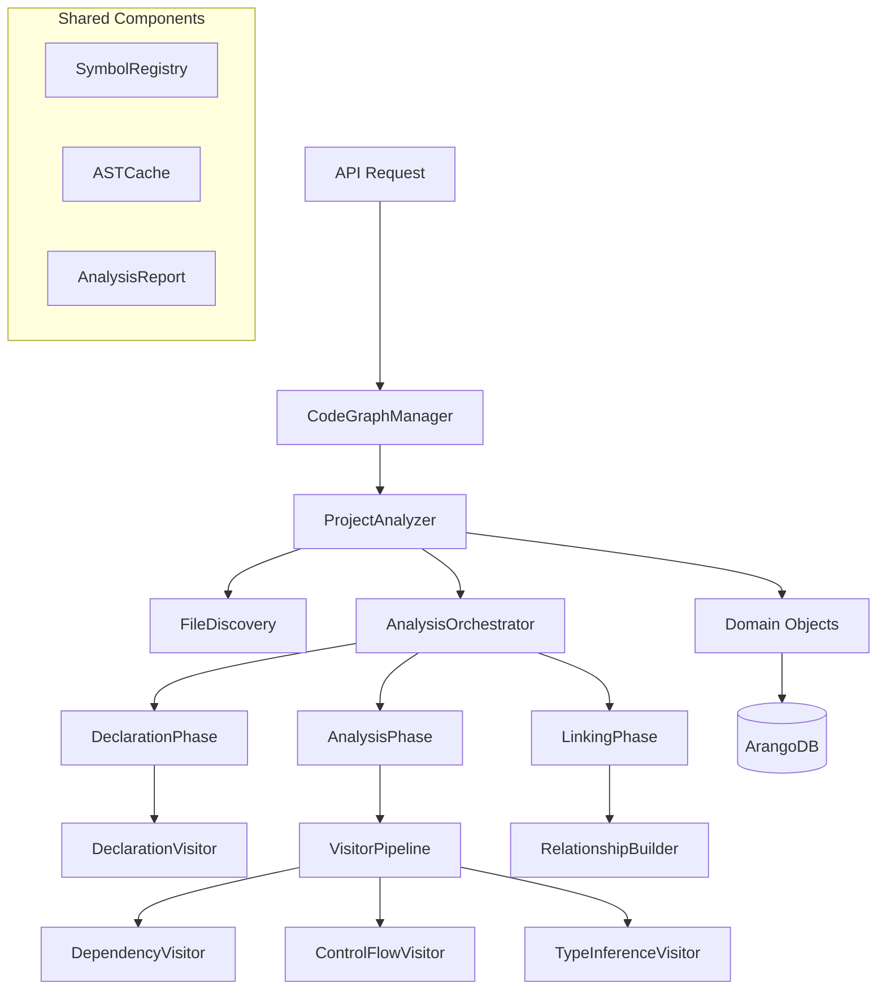

# Enhanced Parser Architecture V2

This document presents an improved architecture that builds upon the existing design while addressing scalability, flexibility, and integration concerns for the MVP and future development.

## Core Improvements Over V1

### 1. Unified Domain Integration
- **Integration with Existing Core**: The parser now works seamlessly with the existing `Project`, `File`, `Folder` domain objects instead of bypassing them
- **Consistent API**: All operations go through the `CodeGraphManager` for unified domain management
- **Event-Driven Architecture**: Parser publishes events that other services can subscribe to

### 2. Modular Visitor System
- **Plugin Architecture**: Visitors are now pluggable components that can be added/removed without core changes
- **Context Sharing**: Improved `VisitorContext` that allows visitors to share data efficiently
- **Staged Processing**: Clear separation between declaration, analysis, and linking phases

### 3. Enhanced Error Resilience
- **Graceful Degradation**: System continues processing even when individual files fail
- **Structured Reporting**: Comprehensive analysis reporting with different severity levels
- **Recovery Strategies**: Automatic fallback mechanisms for common parsing issues

## Updated Architecture Overview



## Key Architecture Decisions

### 1. Three-Phase Processing
**Why**: Separates concerns and enables better error handling and parallelization

1. **Declaration Phase**: Fast discovery of all symbols (functions, classes, variables)
2. **Analysis Phase**: Deep analysis with visitors (dependencies, control flow, types)
3. **Linking Phase**: Create relationships and validate references

### 2. Symbol Registry Pattern
**Why**: Centralized symbol resolution with caching and persistence

- Acts as single source of truth for symbol resolution
- Caches expensive lookups
- Supports incremental updates
- Enables cross-file reference resolution

### 3. Domain Object Integration
**Why**: Maintains consistency with existing architecture

- Uses existing `Project`, `File`, `Folder` domain objects
- Extends rather than replaces current patterns
- Maintains transaction boundaries
- Preserves existing API contracts

## Component Design

### 1. ProjectAnalyzer (Enhanced)
**Responsibility**: High-level orchestration and integration with domain layer

```python
class ProjectAnalyzer:
    def __init__(self, manager: CodeGraphManager):
        self.manager = manager
        self.symbol_registry = SymbolRegistry()
        self.ast_cache = ASTCache()
        
    async def analyze_project(self, project: Project) -> AnalysisResult:
        """Main entry point for project analysis"""
        orchestrator = AnalysisOrchestrator(
            project=project,
            symbol_registry=self.symbol_registry,
            ast_cache=self.ast_cache
        )
        return await orchestrator.run()
        
    async def analyze_incremental(self, project: Project, changed_files: List[str]) -> AnalysisResult:
        """Incremental analysis for changed files only"""
        # Implementation in separate file
```

### 2. AnalysisOrchestrator
**Responsibility**: Multi-phase analysis coordination

```python
class AnalysisOrchestrator:
    def __init__(self, project: Project, symbol_registry: SymbolRegistry, ast_cache: ASTCache):
        self.project = project
        self.symbol_registry = symbol_registry
        self.ast_cache = ast_cache
        self.report = AnalysisReport()
        
    async def run(self) -> AnalysisResult:
        """Run the three-phase analysis"""
        try:
            files = await self.discover_files()
            
            # Phase 1: Declaration (parallelizable)
            await self.run_declaration_phase(files)
            
            # Phase 2: Analysis (dependency-aware parallelization)
            await self.run_analysis_phase(files)
            
            # Phase 3: Linking (sequential for consistency)
            await self.run_linking_phase(files)
            
        except Exception as e:
            self.report.add_fatal_error(e)
            
        return AnalysisResult(
            project=self.project,
            report=self.report,
            symbol_registry=self.symbol_registry
        )
```

## Scalability Features

### 1. Incremental Analysis
Only re-analyze changed files and their dependents:
- Dependency tracking for impact analysis
- Smart caching with invalidation
- Minimal database updates

### 2. Parallel Processing
Safe parallelization where dependencies allow:
- Declaration phase: fully parallel
- Analysis phase: dependency-aware batching  
- Linking phase: sequential for consistency

### 3. Memory Management
Efficient handling of large codebases:
- LRU caches for ASTs and symbols
- Batch processing for memory constraints
- Configurable cache sizes

### 4. Plugin Architecture
Extensible visitor system:
- Pluggable visitors for different analysis types
- Configuration-driven visitor selection
- Custom analyzers for specific needs

## Integration with Existing System

### Domain Object Harmony
```python
# Uses existing domain objects
project = code_graph_manager.load_project(project_id)
files = project.get_files()

# Extends with analysis capabilities
analyzer = ProjectAnalyzer(code_graph_manager)
result = await analyzer.analyze_project(project)

# Updates domain objects with results
await project.update_analysis_metadata(result.metrics)
```

### Database Integration
- Uses existing ORM layer (`db.collections`)
- Maintains transaction boundaries
- Supports existing query patterns
- Adds analysis-specific collections

## Error Handling Strategy

### Levels of Error Handling
1. **File-level**: Syntax errors, permission issues
2. **Symbol-level**: Unresolved imports, missing references
3. **System-level**: Database errors, memory issues

### Recovery Mechanisms
- Continue processing on file errors
- Fallback symbol resolution strategies
- Partial results for incomplete analysis

## Next Steps

See the implementation files for detailed designs of:
- Enhanced models (`models/`)
- Visitor implementations (`implementations/`)
- Usage examples (`examples/`)

This architecture provides a solid foundation for MVP while enabling future enhancements through its modular, extensible design. 