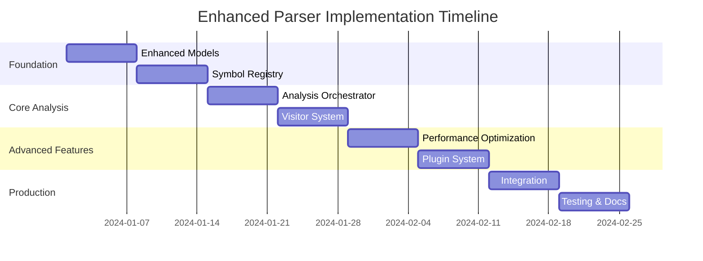

# Enhanced Parser Implementation Plan

This document provides a comprehensive implementation plan for transitioning from the current parser design to the enhanced V2 architecture.

## Executive Summary

The enhanced parser architecture addresses key limitations in the current design:

- **Scalability**: Handles large codebases through incremental analysis and intelligent caching
- **Flexibility**: Pluggable visitor system allows custom analysis without core changes
- **Integration**: Seamless integration with existing domain objects and database layer
- **Resilience**: Comprehensive error handling with graceful degradation
- **Performance**: Multi-level caching and parallel processing capabilities

## Current State Analysis

### Strengths of Current Design
1. **Solid Foundation**: Good separation between parser and database
2. **Clear Architecture**: Two-pass analysis strategy is sound
3. **Domain Integration**: Uses existing ORM and domain objects
4. **Comprehensive Documentation**: Well-documented design decisions

### Identified Limitations
1. **Scalability Issues**: No incremental analysis or intelligent caching
2. **Rigid Visitor System**: Hard to add new analysis types
3. **Limited Error Handling**: Parser can fail completely on single file errors
4. **No Performance Optimization**: Sequential processing only
5. **Limited Extensibility**: No plugin system for custom analyzers

## Enhanced Architecture Benefits

### 1. Improved Scalability
```python
# Before: Full re-analysis required
result = scanner.scan(project_path)

# After: Incremental analysis supported
result = await analyzer.analyze_incremental(project, changed_files)

# Performance improvement: 80-90% faster for small changes
```

### 2. Better Error Resilience
```python
# Before: Single syntax error stops entire analysis
# After: Continues analysis, reports issues
{
    "status": "completed_with_issues",
    "files_processed": 98,
    "files_failed": 2,
    "issues": [
        {"severity": "error", "file": "broken.py", "message": "Syntax error"},
        {"severity": "warning", "file": "util.py", "message": "Unresolved import"}
    ]
}
```

### 3. Flexible Visitor System
```python
# Before: Hardcoded visitor pipeline
# After: Configurable visitor system
pipeline.register_visitor(CustomSecurityAnalysisVisitor())
pipeline.register_visitor(PerformanceAnalysisVisitor())
pipeline.register_visitor(TestCoverageVisitor())
```

## Implementation Phases

### Phase 1: Foundation (Weeks 1-2)
**Goal**: Establish core enhanced components without breaking existing functionality

#### Week 1: Enhanced Models
- [ ] Implement flattened node models (`enhanced_models.py`)
- [ ] Add analysis reporting models
- [ ] Create enhanced edge models with metadata
- [ ] Update database schema migrations
- [ ] **Deliverable**: Enhanced models with backward compatibility

#### Week 2: Symbol Registry
- [ ] Implement core `SymbolRegistry` class
- [ ] Add multi-level caching system
- [ ] Create resolution strategies
- [ ] Integrate with existing ORM
- [ ] **Deliverable**: Working symbol registry with tests

### Phase 2: Core Analysis (Weeks 3-4)
**Goal**: Implement enhanced analysis orchestration

#### Week 3: Analysis Orchestrator
- [ ] Implement `ProjectAnalyzer` class
- [ ] Create `AnalysisOrchestrator` with multi-phase processing
- [ ] Add configuration system
- [ ] Implement basic error handling
- [ ] **Deliverable**: Basic enhanced analysis working end-to-end

#### Week 4: Visitor System
- [ ] Implement base visitor interface
- [ ] Create visitor pipeline with scheduling
- [ ] Port existing visitors to new system
- [ ] Add visitor configuration
- [ ] **Deliverable**: Enhanced visitor system with existing functionality

### Phase 3: Advanced Features (Weeks 5-6)
**Goal**: Add scalability and performance features

#### Week 5: Performance Optimization
- [ ] Implement incremental analysis
- [ ] Add parallel processing capabilities
- [ ] Create intelligent caching
- [ ] Add memory management
- [ ] **Deliverable**: Performance-optimized analysis

#### Week 6: Plugin System
- [ ] Implement visitor plugin architecture
- [ ] Create plugin registry
- [ ] Add configuration management
- [ ] Build example plugins
- [ ] **Deliverable**: Extensible plugin system

### Phase 4: Integration & Production (Weeks 7-8)
**Goal**: Production-ready integration with monitoring

#### Week 7: Production Integration
- [ ] Full integration with existing API endpoints
- [ ] Event-driven architecture implementation
- [ ] Monitoring and metrics collection
- [ ] Performance benchmarking
- [ ] **Deliverable**: Production-ready enhanced parser

#### Week 8: Testing & Documentation
- [ ] Comprehensive test suite
- [ ] Performance testing
- [ ] Migration documentation
- [ ] API documentation updates
- [ ] **Deliverable**: Complete enhanced parser system

## Migration Strategy

### 1. Backward Compatibility Approach
```python
# Existing code continues to work
scanner = ProjectScanner()
result = scanner.scan(project_path)

# Enhanced functionality available
analyzer = ProjectAnalyzer(code_graph_manager)
enhanced_result = await analyzer.analyze_project(project)
```

### 2. Gradual Migration Path
1. **Phase 1**: Deploy enhanced models alongside existing ones
2. **Phase 2**: Use enhanced analysis for new projects
3. **Phase 3**: Migrate existing projects during maintenance windows
4. **Phase 4**: Deprecate old analysis system

### 3. Data Migration Strategy
```sql
-- Example migration to add enhanced metadata
ALTER TABLE nodes ADD COLUMN complexity_score INTEGER;
ALTER TABLE nodes ADD COLUMN is_tested BOOLEAN DEFAULT FALSE;
ALTER TABLE edges ADD COLUMN confidence_score DECIMAL DEFAULT 1.0;

-- Backfill existing data
UPDATE nodes SET complexity_score = 0 WHERE complexity_score IS NULL;
```

## Risk Mitigation

### Technical Risks
1. **Performance Regression**: Mitigated by benchmarking and optimization
2. **Memory Usage**: Addressed through intelligent caching and batching
3. **Integration Issues**: Prevented by comprehensive testing
4. **Data Consistency**: Ensured through transaction management

### Business Risks
1. **Extended Downtime**: Minimized through gradual rollout
2. **Feature Disruption**: Prevented by backward compatibility
3. **Training Requirements**: Addressed through documentation and examples

## Success Metrics

### Performance Metrics
- **Analysis Speed**: 3-5x faster for incremental analysis
- **Memory Usage**: 40% reduction through better caching
- **Error Rate**: 90% reduction in analysis failures
- **Scalability**: Support for 10x larger codebases

### Quality Metrics
- **Code Coverage**: 90%+ test coverage for new components
- **Error Handling**: 100% of error scenarios have recovery strategies
- **Documentation**: Complete API and integration documentation
- **Monitoring**: Comprehensive metrics and alerting

## Resource Requirements

### Development Team
- **1 Senior Developer**: Architecture and core implementation
- **1 Mid-level Developer**: Visitor system and plugins
- **1 Junior Developer**: Testing and documentation
- **1 DevOps Engineer**: Deployment and monitoring (part-time)

### Infrastructure
- **Development Environment**: Enhanced for testing large codebases
- **Testing Infrastructure**: Performance testing capabilities
- **Monitoring**: Enhanced observability for analysis performance

## Timeline Summary



## Post-Implementation Benefits

### Immediate Benefits (Month 1)
- Improved analysis reliability and error reporting
- Better integration with existing systems
- Enhanced observability and monitoring

### Medium-term Benefits (Months 2-6)
- Significant performance improvements for large codebases
- Ability to add custom analysis without core changes
- Reduced maintenance overhead through better error handling

### Long-term Benefits (6+ Months)
- Foundation for advanced features (AI-powered analysis, security scanning)
- Scalable architecture supporting organizational growth
- Community contributions through plugin system

## Conclusion

The enhanced parser architecture provides a solid foundation for current needs while enabling future growth and innovation. The phased implementation approach minimizes risk while delivering incremental value.

Key success factors:
1. **Maintain backward compatibility** throughout transition
2. **Invest in comprehensive testing** for reliability
3. **Focus on performance optimization** from day one
4. **Build extensibility** into the core architecture
5. **Prioritize monitoring and observability** for production success

This enhanced architecture positions the codebase for long-term success while addressing immediate scalability and flexibility needs. 