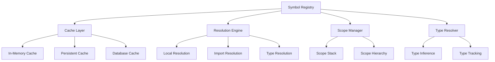

# Enhanced Symbol Registry Design

The Symbol Registry is the central component for symbol resolution, caching, and cross-reference tracking in the enhanced parser architecture.

## Core Principles

1. **Single Source of Truth**: All symbol resolution goes through the registry
2. **Intelligent Caching**: Multi-level caching with smart invalidation
3. **Incremental Updates**: Support for partial updates without full rebuilds
4. **Cross-File Resolution**: Efficient resolution of symbols across file boundaries
5. **Type Awareness**: Track and resolve types for better analysis

## Architecture Overview



## Core Components

### 1. SymbolRegistry (Main Interface)

```python
class SymbolRegistry:
    """
    Central symbol resolution and caching system.
    Provides fast, context-aware symbol lookup with intelligent caching.
    """
    
    def __init__(self, db_client: DatabaseClient, config: RegistryConfig = None):
        self.config = config or RegistryConfig()
        self.cache = SymbolCache(self.config.cache_config)
        self.resolver = ResolutionEngine(db_client)
        self.scope_manager = ScopeManager()
        self.type_resolver = TypeResolver()
        
        # Performance tracking
        self.stats = RegistryStats()
        
    async def resolve_symbol(
        self, 
        name: str, 
        context: ResolutionContext
    ) -> Optional[ResolvedSymbol]:
        """
        Main symbol resolution method.
        
        Args:
            name: Symbol name to resolve (e.g., 'foo', 'module.func', 'obj.method')
            context: Current resolution context (file, scope, imports, etc.)
            
        Returns:
            ResolvedSymbol if found, None otherwise
        """
        self.stats.resolution_attempts += 1
        
        # Check cache first
        cache_key = self._build_cache_key(name, context)
        if cached := await self.cache.get(cache_key):
            self.stats.cache_hits += 1
            return cached
            
        # Resolve using appropriate strategy
        resolved = await self._resolve_with_strategy(name, context)
        
        if resolved:
            # Cache successful resolution
            await self.cache.set(cache_key, resolved, context.cache_ttl)
            self.stats.successful_resolutions += 1
        else:
            self.stats.failed_resolutions += 1
            
        return resolved
        
    async def register_symbol(
        self, 
        symbol: Symbol, 
        context: RegistrationContext
    ) -> None:
        """
        Register a new symbol in the registry.
        Used during the declaration phase.
        """
        # Add to resolver's symbol table
        await self.resolver.register_symbol(symbol, context)
        
        # Invalidate related cache entries
        await self.cache.invalidate_related(symbol.qname)
        
        # Update scope information
        if context.scope_id:
            self.scope_manager.add_symbol_to_scope(context.scope_id, symbol)
            
    async def create_scope(
        self, 
        scope_type: ScopeType, 
        scope_id: str,
        parent_scope_id: Optional[str] = None
    ) -> Scope:
        """Create and register a new scope"""
        return self.scope_manager.create_scope(scope_type, scope_id, parent_scope_id)
```

### 2. Resolution Engine

```python
class ResolutionEngine:
    """
    Core symbol resolution logic with multiple resolution strategies.
    """
    
    def __init__(self, db_client: DatabaseClient):
        self.db_client = db_client
        self.strategies = [
            LocalScopeStrategy(),
            ImportResolutionStrategy(),
            GlobalScopeStrategy(),
            ExternalPackageStrategy(),
        ]
        
    async def resolve(self, name: str, context: ResolutionContext) -> Optional[ResolvedSymbol]:
        """Try each resolution strategy in order"""
        for strategy in self.strategies:
            if result := await strategy.resolve(name, context):
                return result
        return None
        
    async def register_symbol(self, symbol: Symbol, context: RegistrationContext):
        """Register symbol with appropriate strategy"""
        # Update symbol table
        await self._update_symbol_table(symbol)
        
        # Update import mappings if needed
        if symbol.node_type == "file":
            await self._update_import_mappings(symbol, context)
```

### 3. Multi-Level Caching System

```python
class SymbolCache:
    """
    Multi-level caching system for symbol resolution results.
    
    Levels:
    1. In-memory LRU cache (fastest)
    2. Redis cache (shared across processes)
    3. Database cache (persistent)
    """
    
    def __init__(self, config: CacheConfig):
        self.config = config
        self.memory_cache = LRUCache(config.memory_cache_size)
        self.redis_cache = RedisCache(config.redis_config) if config.use_redis else None
        self.db_cache = DatabaseCache(config.db_config) if config.use_db_cache else None
        
    async def get(self, key: str) -> Optional[ResolvedSymbol]:
        """Get from cache, trying each level in order"""
        # Level 1: Memory cache
        if result := self.memory_cache.get(key):
            return result
            
        # Level 2: Redis cache
        if self.redis_cache and (result := await self.redis_cache.get(key)):
            # Promote to memory cache
            self.memory_cache.set(key, result)
            return result
            
        # Level 3: Database cache
        if self.db_cache and (result := await self.db_cache.get(key)):
            # Promote to higher levels
            self.memory_cache.set(key, result)
            if self.redis_cache:
                await self.redis_cache.set(key, result)
            return result
            
        return None
        
    async def set(self, key: str, value: ResolvedSymbol, ttl: int = None):
        """Set in all cache levels"""
        self.memory_cache.set(key, value)
        
        if self.redis_cache:
            await self.redis_cache.set(key, value, ttl)
            
        if self.db_cache:
            await self.db_cache.set(key, value)
```

### 4. Scope Management

```python
class ScopeManager:
    """
    Manages scope hierarchy and variable resolution within scopes.
    """
    
    def __init__(self):
        self.scopes: Dict[str, Scope] = {}
        self.scope_hierarchy: Dict[str, List[str]] = {}  # parent -> children
        
    def create_scope(
        self, 
        scope_type: ScopeType, 
        scope_id: str,
        parent_scope_id: Optional[str] = None
    ) -> Scope:
        """Create a new scope"""
        scope = Scope(
            id=scope_id,
            type=scope_type,
            parent_id=parent_scope_id,
            symbols={}
        )
        
        self.scopes[scope_id] = scope
        
        if parent_scope_id:
            self.scope_hierarchy.setdefault(parent_scope_id, []).append(scope_id)
            
        return scope
        
    def resolve_in_scope_chain(
        self, 
        name: str, 
        scope_id: str
    ) -> Optional[Symbol]:
        """Resolve symbol by walking up the scope chain"""
        current_scope_id = scope_id
        
        while current_scope_id:
            scope = self.scopes.get(current_scope_id)
            if not scope:
                break
                
            if name in scope.symbols:
                return scope.symbols[name]
                
            # Move to parent scope
            current_scope_id = scope.parent_id
            
        return None
```

## Resolution Strategies

### 1. Local Scope Strategy
Resolves symbols within the current function/class/module scope.

```python
class LocalScopeStrategy(ResolutionStrategy):
    async def resolve(self, name: str, context: ResolutionContext) -> Optional[ResolvedSymbol]:
        if not context.current_scope_id:
            return None
            
        # Try current scope and parent scopes
        symbol = context.scope_manager.resolve_in_scope_chain(name, context.current_scope_id)
        
        if symbol:
            return ResolvedSymbol(
                name=name,
                symbol=symbol,
                resolution_type=ResolutionType.LOCAL_SCOPE,
                confidence=1.0
            )
            
        return None
```

### 2. Import Resolution Strategy
Resolves imported symbols and handles aliases.

```python
class ImportResolutionStrategy(ResolutionStrategy):
    async def resolve(self, name: str, context: ResolutionContext) -> Optional[ResolvedSymbol]:
        # Handle dotted names (e.g., 'module.function')
        parts = name.split('.')
        base_name = parts[0]
        
        # Check if base name is an import alias
        import_info = context.imports.get(base_name)
        if not import_info:
            return None
            
        # Build full qualified name
        if len(parts) == 1:
            # Direct import usage
            target_qname = import_info.target_qname
        else:
            # Attribute access on imported module
            target_qname = f"{import_info.target_qname}.{'.'.join(parts[1:])}"
            
        # Look up the target symbol
        symbol = await self._lookup_by_qname(target_qname)
        
        if symbol:
            return ResolvedSymbol(
                name=name,
                symbol=symbol,
                resolution_type=ResolutionType.IMPORT,
                confidence=0.9,
                import_info=import_info
            )
            
        return None
```

### 3. Type-Aware Resolution
Advanced resolution using type information.

```python
class TypeInferenceStrategy(ResolutionStrategy):
    async def resolve(self, name: str, context: ResolutionContext) -> Optional[ResolvedSymbol]:
        # Handle method calls on typed variables (e.g., 'user.get_name()')
        if '.' not in name:
            return None
            
        obj_name, method_name = name.split('.', 1)
        
        # Find the variable and its type
        var_symbol = await self._resolve_variable(obj_name, context)
        if not var_symbol or not var_symbol.inferred_type:
            return None
            
        # Look up method on the type
        method_qname = f"{var_symbol.inferred_type}.{method_name}"
        method_symbol = await self._lookup_by_qname(method_qname)
        
        if method_symbol:
            return ResolvedSymbol(
                name=name,
                symbol=method_symbol,
                resolution_type=ResolutionType.TYPE_INFERENCE,
                confidence=0.8,
                type_info=TypeInfo(
                    object_type=var_symbol.inferred_type,
                    method_name=method_name
                )
            )
            
        return None
```

## Performance Optimizations

### 1. Batch Resolution
Process multiple symbols in a single database query:

```python
async def resolve_batch(
    self, 
    names: List[str], 
    context: ResolutionContext
) -> Dict[str, Optional[ResolvedSymbol]]:
    """Resolve multiple symbols efficiently"""
    
    # Separate cached from uncached
    cached_results = {}
    uncached_names = []
    
    for name in names:
        cache_key = self._build_cache_key(name, context)
        if cached := await self.cache.get(cache_key):
            cached_results[name] = cached
        else:
            uncached_names.append(name)
    
    # Batch resolve uncached names
    if uncached_names:
        batch_results = await self.resolver.resolve_batch(uncached_names, context)
        
        # Cache results
        for name, result in batch_results.items():
            if result:
                cache_key = self._build_cache_key(name, context)
                await self.cache.set(cache_key, result)
                
        cached_results.update(batch_results)
    
    return cached_results
```

### 2. Smart Cache Invalidation
Invalidate only related cache entries:

```python
async def invalidate_related(self, changed_symbol_qname: str):
    """Invalidate cache entries related to a changed symbol"""
    
    # Find all cache keys that might be affected
    affected_keys = []
    
    # Direct references
    affected_keys.extend(await self._find_keys_by_pattern(f"*{changed_symbol_qname}*"))
    
    # Import-based references
    affected_keys.extend(await self._find_import_related_keys(changed_symbol_qname))
    
    # Type-based references
    if await self._is_type_symbol(changed_symbol_qname):
        affected_keys.extend(await self._find_type_related_keys(changed_symbol_qname))
    
    # Batch invalidate
    await self.cache.invalidate_batch(affected_keys)
```

## Integration with Existing System

The Symbol Registry integrates with the existing domain objects and database layer:

```python
# Integration with Project domain object
async def analyze_project_with_registry(project: Project) -> AnalysisResult:
    """Analyze project using enhanced symbol registry"""
    
    # Create registry for this project
    registry = SymbolRegistry(db_client, RegistryConfig(
        project_id=project.id,
        cache_prefix=f"project:{project.id}"
    ))
    
    # Use existing domain methods to get files
    files = project.get_files()
    
    # Populate registry with existing symbols from database
    await registry.populate_from_database(project.id)
    
    # Run analysis with registry
    analyzer = ProjectAnalyzer(registry)
    return await analyzer.analyze_project(project)
```

This design provides a robust, scalable symbol resolution system that can handle large codebases efficiently while maintaining integration with the existing architecture. 