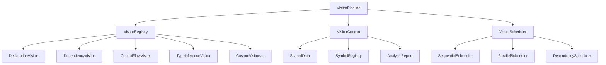

# Enhanced Visitor System Design

The visitor system is redesigned as a pluggable, configurable pipeline that can be extended without modifying core components.

## Core Principles

1. **Plugin Architecture**: Visitors are independent, pluggable components
2. **Shared Context**: Efficient data sharing between visitors
3. **Configurable Pipeline**: Enable/disable visitors based on needs
4. **Error Isolation**: Visitor failures don't crash the entire pipeline
5. **Performance Monitoring**: Track visitor performance and optimize bottlenecks

## Architecture Overview



## Core Components

### 1. Base Visitor Interface

```python
from abc import ABC, abstractmethod
from typing import Any, Dict, List, Optional, Set
import ast

class BaseVisitor(ABC):
    """
    Base class for all AST visitors in the enhanced system.
    Provides common functionality and enforces visitor contract.
    """
    
    def __init__(self, config: VisitorConfig = None):
        self.config = config or VisitorConfig()
        self.name = self.__class__.__name__
        self.enabled = True
        self.stats = VisitorStats()
        
    @abstractmethod
    async def process(self, context: VisitorContext) -> VisitorResult:
        """
        Main processing method that each visitor must implement.
        
        Args:
            context: Shared context containing AST, file info, and other visitors' results
            
        Returns:
            VisitorResult containing nodes, edges, and metadata created by this visitor
        """
        pass
        
    @abstractmethod
    def get_dependencies(self) -> Set[str]:
        """
        Return set of visitor names this visitor depends on.
        Used for scheduling and dependency resolution.
        """
        return set()
        
    def get_priority(self) -> int:
        """Return visitor priority (lower numbers run first)"""
        return 100
        
    def should_process_file(self, file_path: str) -> bool:
        """Determine if this visitor should process the given file"""
        return file_path.endswith('.py')
        
    async def setup(self, context: VisitorContext) -> None:
        """Setup hook called before processing"""
        pass
        
    async def cleanup(self, context: VisitorContext) -> None:
        """Cleanup hook called after processing"""
        pass
```

### 2. Visitor Context (Shared State)

```python
class VisitorContext:
    """
    Shared context passed to all visitors.
    Contains file information, AST, and results from other visitors.
    """
    
    def __init__(
        self, 
        file: File, 
        ast_tree: ast.Module, 
        symbol_registry: SymbolRegistry,
        report: AnalysisReport
    ):
        self.file = file
        self.ast_tree = ast_tree
        self.symbol_registry = symbol_registry
        self.report = report
        
        # Shared data store for visitors to communicate
        self.shared_data: Dict[str, Any] = {}
        
        # Results from completed visitors
        self.visitor_results: Dict[str, VisitorResult] = {}
        
        # Current scope information
        self.current_scope_id: Optional[str] = None
        self.scope_stack: List[str] = []
        
        # File-level metadata
        self.imports: Dict[str, ImportInfo] = {}
        self.exports: Dict[str, ExportInfo] = {}
        
    def get_visitor_result(self, visitor_name: str) -> Optional[VisitorResult]:
        """Get results from a specific visitor"""
        return self.visitor_results.get(visitor_name)
        
    def set_shared_data(self, key: str, value: Any) -> None:
        """Set shared data for other visitors to use"""
        self.shared_data[key] = value
        
    def get_shared_data(self, key: str, default: Any = None) -> Any:
        """Get shared data set by other visitors"""
        return self.shared_data.get(key, default)
        
    def push_scope(self, scope_id: str) -> None:
        """Enter a new scope"""
        self.scope_stack.append(self.current_scope_id)
        self.current_scope_id = scope_id
        
    def pop_scope(self) -> Optional[str]:
        """Exit current scope"""
        old_scope = self.current_scope_id
        self.current_scope_id = self.scope_stack.pop() if self.scope_stack else None
        return old_scope
        
    def report_error(self, message: str, position: Optional[CodePosition] = None):
        """Report an error to the analysis report"""
        self.report.add_error(message, self.file.path, position)
        
    def report_warning(self, message: str, position: Optional[CodePosition] = None):
        """Report a warning to the analysis report"""
        self.report.add_warning(message, self.file.path, position)
```

### 3. Visitor Pipeline

```python
class VisitorPipeline:
    """
    Manages and executes a pipeline of visitors for file analysis.
    """
    
    def __init__(
        self, 
        symbol_registry: SymbolRegistry,
        scheduler: VisitorScheduler = None
    ):
        self.symbol_registry = symbol_registry
        self.scheduler = scheduler or SequentialScheduler()
        self.visitors: List[BaseVisitor] = []
        self.visitor_registry: Dict[str, BaseVisitor] = {}
        
    def register_visitor(self, visitor: BaseVisitor) -> None:
        """Register a visitor with the pipeline"""
        self.visitors.append(visitor)
        self.visitor_registry[visitor.name] = visitor
        
    def register_visitors(self, visitors: List[BaseVisitor]) -> None:
        """Register multiple visitors"""
        for visitor in visitors:
            self.register_visitor(visitor)
            
    def get_visitor(self, name: str) -> Optional[BaseVisitor]:
        """Get a registered visitor by name"""
        return self.visitor_registry.get(name)
        
    async def process_file(
        self, 
        file: File, 
        ast_tree: ast.Module,
        report: AnalysisReport
    ) -> PipelineResult:
        """
        Process a file through all registered visitors.
        """
        context = VisitorContext(file, ast_tree, self.symbol_registry, report)
        
        # Filter enabled visitors for this file
        active_visitors = [
            v for v in self.visitors 
            if v.enabled and v.should_process_file(file.path)
        ]
        
        # Schedule and execute visitors
        execution_plan = self.scheduler.create_execution_plan(active_visitors)
        
        pipeline_result = PipelineResult()
        
        try:
            for batch in execution_plan:
                batch_results = await self._execute_visitor_batch(batch, context)
                
                # Merge results
                for visitor_name, result in batch_results.items():
                    context.visitor_results[visitor_name] = result
                    pipeline_result.merge_visitor_result(visitor_name, result)
                    
        except Exception as e:
            context.report_error(f"Pipeline execution failed: {str(e)}")
            pipeline_result.success = False
            
        return pipeline_result
        
    async def _execute_visitor_batch(
        self, 
        visitors: List[BaseVisitor], 
        context: VisitorContext
    ) -> Dict[str, VisitorResult]:
        """Execute a batch of visitors (potentially in parallel)"""
        
        results = {}
        
        # Setup all visitors in batch
        for visitor in visitors:
            try:
                await visitor.setup(context)
            except Exception as e:
                context.report_error(f"Visitor {visitor.name} setup failed: {str(e)}")
                
        # Process all visitors in batch
        if len(visitors) == 1:
            # Single visitor - direct execution
            visitor = visitors[0]
            try:
                result = await visitor.process(context)
                results[visitor.name] = result
            except Exception as e:
                context.report_error(f"Visitor {visitor.name} failed: {str(e)}")
                results[visitor.name] = VisitorResult(success=False, error=str(e))
        else:
            # Multiple visitors - parallel execution
            tasks = []
            for visitor in visitors:
                task = asyncio.create_task(self._safe_visitor_process(visitor, context))
                tasks.append((visitor.name, task))
                
            for visitor_name, task in tasks:
                try:
                    result = await task
                    results[visitor_name] = result
                except Exception as e:
                    context.report_error(f"Visitor {visitor_name} failed: {str(e)}")
                    results[visitor_name] = VisitorResult(success=False, error=str(e))
                    
        # Cleanup all visitors in batch
        for visitor in visitors:
            try:
                await visitor.cleanup(context)
            except Exception as e:
                context.report_error(f"Visitor {visitor.name} cleanup failed: {str(e)}")
                
        return results
        
    async def _safe_visitor_process(
        self, 
        visitor: BaseVisitor, 
        context: VisitorContext
    ) -> VisitorResult:
        """Safely execute a visitor with error handling"""
        try:
            start_time = time.time()
            result = await visitor.process(context)
            execution_time = time.time() - start_time
            
            # Update visitor stats
            visitor.stats.executions += 1
            visitor.stats.total_time += execution_time
            visitor.stats.avg_time = visitor.stats.total_time / visitor.stats.executions
            
            return result
            
        except Exception as e:
            visitor.stats.errors += 1
            return VisitorResult(success=False, error=str(e))
```

## Concrete Visitor Implementations

### 1. Enhanced Declaration Visitor

```python
class DeclarationVisitor(BaseVisitor, ast.NodeVisitor):
    """
    Enhanced declaration visitor with better scope tracking and metadata collection.
    """
    
    def __init__(self, config: VisitorConfig = None):
        super().__init__(config)
        self.declared_functions: List[ast.FunctionDef] = []
        self.declared_classes: List[ast.ClassDef] = []
        self.declared_variables: List[ast.Assign] = []
        self.imports: List[Union[ast.Import, ast.ImportFrom]] = []
        
    def get_dependencies(self) -> Set[str]:
        return set()  # No dependencies - runs first
        
    def get_priority(self) -> int:
        return 10  # High priority - runs early
        
    async def process(self, context: VisitorContext) -> VisitorResult:
        """Process AST to find all declarations"""
        
        # Reset collections
        self.declared_functions.clear()
        self.declared_classes.clear()
        self.declared_variables.clear()
        self.imports.clear()
        
        # Visit the AST
        self.visit(context.ast_tree)
        
        # Create nodes from declarations
        nodes = []
        
        # Process functions
        for func_ast in self.declared_functions:
            func_node = await self._create_function_node(func_ast, context)
            if func_node:
                nodes.append(func_node)
                
        # Process classes
        for class_ast in self.declared_classes:
            class_node = await self._create_class_node(class_ast, context)
            if class_node:
                nodes.append(class_node)
                
        # Process variables
        for var_ast in self.declared_variables:
            var_nodes = await self._create_variable_nodes(var_ast, context)
            nodes.extend(var_nodes)
            
        # Store import information in context for other visitors
        context.set_shared_data('imports', self._process_imports())
        
        return VisitorResult(
            nodes=nodes,
            metadata={
                'functions_found': len(self.declared_functions),
                'classes_found': len(self.declared_classes),
                'variables_found': len(self.declared_variables),
                'imports_found': len(self.imports)
            }
        )
        
    def visit_FunctionDef(self, node: ast.FunctionDef) -> None:
        """Visit function definition"""
        self.declared_functions.append(node)
        # Don't visit function body in declaration phase
        
    def visit_AsyncFunctionDef(self, node: ast.AsyncFunctionDef) -> None:
        """Visit async function definition"""
        self.declared_functions.append(node)
        
    def visit_ClassDef(self, node: ast.ClassDef) -> None:
        """Visit class definition"""
        self.declared_classes.append(node)
        # Visit class body to find methods
        self.generic_visit(node)
        
    def visit_Assign(self, node: ast.Assign) -> None:
        """Visit variable assignments"""
        # Only capture top-level assignments for now
        if self._is_global_assignment(node):
            self.declared_variables.append(node)
        self.generic_visit(node)
        
    def visit_Import(self, node: ast.Import) -> None:
        """Visit import statement"""
        self.imports.append(node)
        
    def visit_ImportFrom(self, node: ast.ImportFrom) -> None:
        """Visit from-import statement"""
        self.imports.append(node)
        
    async def _create_function_node(
        self, 
        func_ast: ast.FunctionDef, 
        context: VisitorContext
    ) -> Optional[FunctionNode]:
        """Create FunctionNode from AST"""
        try:
            # Extract function information
            qname = f"{context.file.qname}.{func_ast.name}"
            
            # Determine function characteristics
            is_async = isinstance(func_ast, ast.AsyncFunctionDef)
            is_method = self._is_method(func_ast)
            
            # Extract parameters
            parameters = self._extract_parameters(func_ast.args)
            
            # Extract return type hint
            return_type = self._extract_type_hint(func_ast.returns)
            
            # Extract docstring
            docstring = ast.get_docstring(func_ast)
            
            # Create the node
            func_node = FunctionNode(
                name=func_ast.name,
                qname=qname,
                start_line=func_ast.lineno,
                end_line=func_ast.end_lineno or func_ast.lineno,
                start_col=func_ast.col_offset,
                end_col=func_ast.end_col_offset or 0,
                is_async=is_async,
                is_method=is_method,
                parameters=parameters,
                return_type_hint=return_type,
                docstring=docstring
            )
            
            # Register with symbol registry
            await context.symbol_registry.register_symbol(
                func_node,
                RegistrationContext(
                    file_id=context.file.id,
                    scope_id=context.current_scope_id
                )
            )
            
            return func_node
            
        except Exception as e:
            context.report_error(f"Failed to create function node for {func_ast.name}: {str(e)}")
            return None
```

### 2. Enhanced Dependency Visitor

```python
class DependencyVisitor(BaseVisitor, ast.NodeVisitor):
    """
    Enhanced dependency visitor with better import resolution and usage tracking.
    """
    
    def get_dependencies(self) -> Set[str]:
        return {"DeclarationVisitor"}  # Needs declarations first
        
    def get_priority(self) -> int:
        return 20
        
    async def process(self, context: VisitorContext) -> VisitorResult:
        """Process dependencies and imports"""
        
        # Get import information from DeclarationVisitor
        imports_data = context.get_shared_data('imports', {})
        
        # Track usage
        self.import_usage: Dict[str, List[CodePosition]] = {}
        self.current_context = context
        
        # Visit AST to find import usage
        self.visit(context.ast_tree)
        
        # Create edges for import usage
        edges = []
        for import_name, usages in self.import_usage.items():
            edge = await self._create_import_edge(import_name, usages, context)
            if edge:
                edges.append(edge)
                
        return VisitorResult(
            edges=edges,
            metadata={
                'imports_used': len(self.import_usage),
                'total_usages': sum(len(usages) for usages in self.import_usage.values())
            }
        )
        
    def visit_Name(self, node: ast.Name) -> None:
        """Track usage of imported names"""
        if isinstance(node.ctx, ast.Load):
            self._record_usage(node.id, node)
        self.generic_visit(node)
        
    def visit_Attribute(self, node: ast.Attribute) -> None:
        """Track usage of imported attributes"""
        # Handle cases like 'module.function'
        if isinstance(node.value, ast.Name):
            full_name = f"{node.value.id}.{node.attr}"
            self._record_usage(full_name, node)
        self.generic_visit(node)
        
    def _record_usage(self, name: str, node: ast.AST) -> None:
        """Record usage of an imported symbol"""
        position = CodePosition(
            line_no=node.lineno,
            col_offset=node.col_offset,
            end_line_no=getattr(node, 'end_lineno', node.lineno),
            end_col_offset=getattr(node, 'end_col_offset', node.col_offset)
        )
        
        if name not in self.import_usage:
            self.import_usage[name] = []
        self.import_usage[name].append(position)
```

## Visitor Scheduling

### 1. Sequential Scheduler (Default)

```python
class SequentialScheduler(VisitorScheduler):
    """Simple sequential execution of visitors"""
    
    def create_execution_plan(self, visitors: List[BaseVisitor]) -> List[List[BaseVisitor]]:
        """Create execution plan - each visitor runs sequentially"""
        
        # Sort by priority, then by dependencies
        sorted_visitors = self._topological_sort(visitors)
        
        # Each visitor runs in its own batch (sequential)
        return [[visitor] for visitor in sorted_visitors]
```

### 2. Parallel Scheduler

```python
class ParallelScheduler(VisitorScheduler):
    """Parallel execution where dependencies allow"""
    
    def create_execution_plan(self, visitors: List[BaseVisitor]) -> List[List[BaseVisitor]]:
        """Create execution plan with maximum parallelization"""
        
        # Build dependency graph
        dependency_graph = self._build_dependency_graph(visitors)
        
        # Create batches of visitors that can run in parallel
        batches = []
        remaining_visitors = set(v.name for v in visitors)
        visitor_map = {v.name: v for v in visitors}
        
        while remaining_visitors:
            # Find visitors with no unmet dependencies
            ready_visitors = []
            for visitor_name in remaining_visitors:
                visitor = visitor_map[visitor_name]
                dependencies = visitor.get_dependencies()
                
                if not dependencies or dependencies.isdisjoint(remaining_visitors):
                    ready_visitors.append(visitor)
                    
            if not ready_visitors:
                # Circular dependency - fall back to sequential
                ready_visitors = [visitor_map[next(iter(remaining_visitors))]]
                
            batches.append(ready_visitors)
            
            # Remove processed visitors
            for visitor in ready_visitors:
                remaining_visitors.remove(visitor.name)
                
        return batches
```

## Plugin System

```python
class VisitorPlugin:
    """Base class for visitor plugins"""
    
    def get_visitors(self) -> List[BaseVisitor]:
        """Return visitors provided by this plugin"""
        return []
        
    def get_config_schema(self) -> Dict[str, Any]:
        """Return configuration schema for this plugin"""
        return {}
        
    async def initialize(self, config: Dict[str, Any]) -> None:
        """Initialize plugin with configuration"""
        pass

# Example plugin
class TestCoveragePlugin(VisitorPlugin):
    """Plugin for test coverage analysis"""
    
    def get_visitors(self) -> List[BaseVisitor]:
        return [
            TestFileVisitor(),
            CoverageAnalysisVisitor(),
        ]
        
    def get_config_schema(self) -> Dict[str, Any]:
        return {
            "test_patterns": {
                "type": "array",
                "items": {"type": "string"},
                "default": ["test_*.py", "*_test.py"]
            },
            "coverage_threshold": {
                "type": "number",
                "default": 0.8
            }
        }
```

This visitor system provides maximum flexibility while maintaining performance and reliability. Visitors can be easily added, removed, or reconfigured without affecting the core parsing logic. 