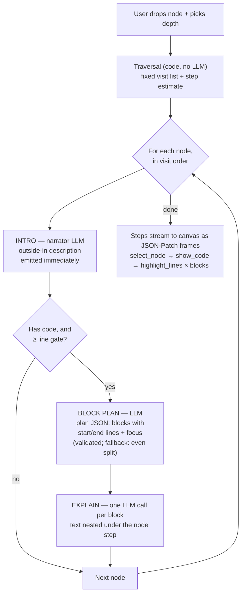

# 00 — Overview

## What we are building

V-NOC already shows a codebase as a graph on a canvas: a project contains folders,
folders contain files, files contain classes and functions, functions contain calls and
nested functions. Every node has a `name`, a `description`, optional attached
`documents`, and — for code nodes — a `position` with start and end line numbers.

The walkthrough agent turns a piece of that graph into a **guided tour**:

1. The user drags one node (function, class, file, or folder) into the chat panel.
2. The user picks a **depth** — the only setting. Depth 0 means "just this node",
   depth 1 adds direct children, depth 2 adds grandchildren, and so on.
3. The UI immediately shows an estimate: how many nodes the tour visits, roughly how
   many steps that makes, and how many LLM calls it costs. We can promise this because
   the pipeline is deterministic (see `03-traversal.md`).
4. The user clicks **Generate**. The agent visits each node in a fixed order — depth
   first: into children and **into call nodes** before siblings. A call node is a
   normal stop (the canvas already shows it with its target function's code — the
   agent resolves nothing); a target that was already explained earlier in the tour
   gets a **contextual stop** instead: what this call does for the caller, with no
   repeated code explanation. Per full stop, the agent runs a small three-part
   micro-pipeline:
   - **Intro** — describe the node from the outside (what it is, why it exists), built
     from its description, docs, and its children's names. One small LLM call.
   - **Block plan** — only if the node has code and the code is long enough: a small
     LLM call reads the code and produces a plan JSON — how many blocks, and the line
     range of each. A 50-line function might become lines 1–10, 10–30, 30–50.
   - **Block explanations** — one small LLM call **per block**, writing the
     explanation for that line range. These nest under the node's step.
5. The tour plays on the canvas step by step. Each step is one of three actions:
   select a node (canvas pans to it), show its code, or highlight a line range with a
   popup explanation in a custom Monaco view. The user clicks **Next** to advance.

## Why there is no node-level planner

An earlier draft had a staged planner LLM (think → frame → node plan), borrowed from
Eregna v2. We removed it for MVP, and the reasoning is worth keeping:

- In Eregna, the planner earns its cost because it makes a real choice: **which** page
  elements, in **which** order. That choice does not exist here — the graph plus a
  depth number already fix the visit list and the order.
- Once every visited node is explained (no keep/skip decision), a node planner's only
  output would be a goal sentence and per-node intents. Not worth three LLM calls and
  two seconds of latency on a cheap-model budget.
- The *thinking* a planner would do is not lost. It moves **inside** the calls that
  remain, as a leading reasoning field the model fills before its answer fields
  (`08-chain-of-thought.md`). Small models benefit most from CoT that sits right next
  to the decision it supports.

If we later add free-form questions ("explain how saving works") — where the tour is
no longer just a subtree — a node planner comes back. The types leave room for it.

## The per-node micro-pipeline, and why it is split this way

The only real planning the LLM does is **inside** one code node: where are the natural
seams in this function? That decision is isolated into its own tiny call, sandwiched
between the intro and the explanations:

**1. Intro first.** It only needs outline data (no code), so it is cheap and fast — and
emitting it immediately means the user starts reading stop N while blocks for stop N
are still being planned. Perceived latency is one small call, not the whole node.

**2. Block plan as its own call, gated by code.**
- **Code gates it.** A function under the line gate (~8 lines) is never split and never
  costs a planning call — the whole body becomes one block. This is why "minimum block
  count" is not a user setting: some functions are one line, so the setting could be
  impossible to honor. A rule computed from the input replaces a guess by the user.
- **Code validates it.** Ranges must sit inside the node's start/end lines, be ordered,
  and not overlap. Bad output → one retry with the validator's message → then a
  deterministic even split. The tour never dies halfway.
- **It is a logged artifact.** The block plan JSON is stored on the session, so we can
  eval "did it split sensibly?" separately from "did it explain well?".

**3. One explainer call per block.** The output of each call is a few sentences — the
most reliable possible shape for a small model. Each call receives the full node code
(for understanding), its own block's range and focus, and one-line summaries of the
blocks already explained (so block 3 doesn't repeat block 1). Batching all block texts
into one call per node is a cost optimization we may add later; it trades reliability
(array-length mismatches, mid-array drift) for fewer calls, so it is not the MVP shape.

## The three actions

The entire language between agent and UI:

| Action | What the canvas does |
|--------|----------------------|
| `select_node` | Pan/zoom to the node, mark it active |
| `show_code` | Expand the node so its code is visible in the Monaco view |
| `highlight_lines` | Highlight a line range in Monaco and show a popup with the explanation |

No collapse, no wait, no arbitrary navigation, no click simulation. The model never
emits actions at all — code assembles them from a fixed pattern per node kind.

## MVP scope

**In:**
- Chat panel with drag-and-drop of one start node.
- One setting: depth. Live estimate of nodes / steps / LLM calls before generating.
- Deterministic traversal (children first, then siblings, source order).
- Per-node micro-pipeline (intro → gated block plan → per-block explanations) on
  LangChain + LangGraph, structured output only, one retry per call, deterministic
  fallbacks.
- Streaming as NDJSON JSON-Patch frames against a session mirror (the Eregna patcher
  pattern): outline first, then each node's intro, block plan, and block texts as they
  are produced.
- Custom Monaco walkthrough component: line highlight + popup + Next / Prev.
- Sessions saved to TerminusDB, **pinned to the graph commit** they were generated
  from — replaying a walkthrough later loads that commit's code, so line highlights
  never drift after the code changes. JSON export for evals.

**Out (deliberately, for MVP):**
- Node-level planner LLM and free-form questions. The drop + depth is the whole query.
- Auto-play, timeline, seek bar — cognitive-replay follow-up. Step data is shaped so it
  can drive that UI later.
- Follow-up chat mid-tour (branching).
- Retrieval / embeddings. Context is assembled by rules, not search.

## Who decides what (the determinism table)

| Decision | Decider |
|----------|---------|
| Which nodes the tour visits, and their order | **Code** — traversal by depth |
| Whether a code node is split into blocks | **Code** — line-count gate |
| How a gated node is split (count + line ranges) | **LLM** (block planner), validated by code, deterministic fallback |
| Which action plays next | **Code** — fixed pattern per node kind |
| Intro and block explanation text | **LLM** (narrator / explainer), retry once, graceful text fallback |

The LLM is a **splitter and a writer**, never a driver.
