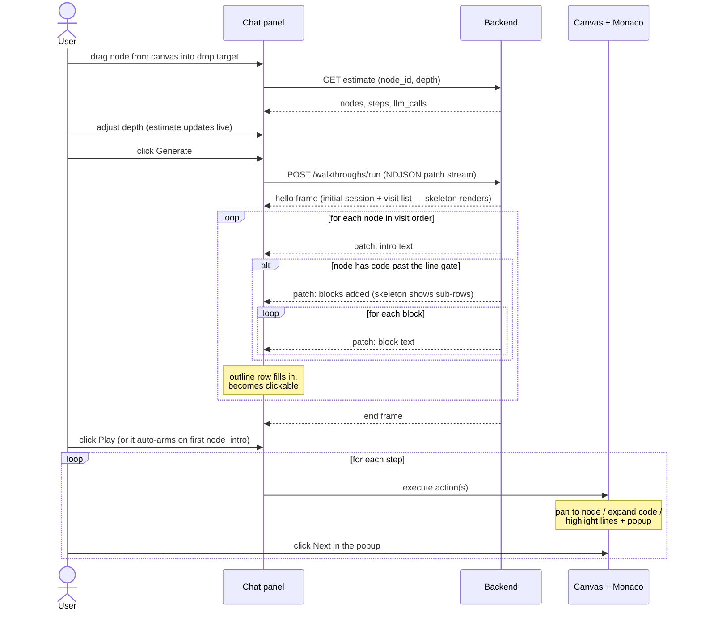

# 01 — User Flow

What the user sees and does, from opening the chat to finishing a tour.

## The chat panel

A slim panel docked next to the canvas (reuse the existing sidebar pattern). For MVP it
is not a real chat — it is a **tour launcher** styled like a chat, so the later chat
upgrade doesn't need a redesign.

```
┌──────────────────────────────┐
│  Walkthrough                 │
├──────────────────────────────┤
│                              │
│  ┌────────────────────────┐  │
│  │  ⬇ Drop a node here    │  │   ← drop target
│  │  function · class ·    │  │
│  │  file · folder         │  │
│  └────────────────────────┘  │
│                              │
│  Depth   [ 0 | 1 | 2 | 3 ]   │   ← the only setting
│                              │
│  ~ 12 nodes · ~ 21 steps     │   ← live estimate, updates
│  ~ 18 LLM calls              │     when depth changes
│                              │
│  [ Generate walkthrough ]    │
└──────────────────────────────┘
```

## End-to-end flow



Three things to notice:

- **The outline arrives before any LLM output.** Traversal is pure code, so the tour
  skeleton (the list of stops with names) renders instantly. LLM latency only affects
  when each row fills in — the user never stares at a shapeless spinner.
- **Generation is visible at block granularity.** The `block_plan` event draws the
  sub-rows ("lines 1–10", "10–30", "30–50") before their texts exist, and each
  `block_text` fills one in. Progress feels continuous even on a slow model.
- **Playback can start before generation finishes.** Steps for stop 1 arrive while
  stop 3 is still being narrated. The player consumes a queue; generation feeds it.

## Playback interaction

MVP is **click-through**, like a product tour — not video-style auto-play.

- Each step shows a popup (anchored to the highlighted lines, or to the node for intro
  steps) with the explanation text and `← Prev · Next →` buttons plus a step counter
  (`7 / 21`).
- `Next` executes the next step's actions. `Prev` re-executes the previous step's
  state — steps are pure descriptions, so replaying one is just executing it again.
- The outline in the chat panel doubles as a table of contents — clicking a stop jumps
  to that node's first step; block sub-rows jump to that block.
- `Esc` or a ✕ button exits the tour; the canvas returns to normal interaction.

Why click-through first: it needs no timing model, no pause/resume state machine, and
no drift handling — and the step data (ordered, self-contained) is exactly what a timed
player needs later. Auto-play becomes "click Next on a timer".

## What plays for each node kind

Fixed pattern, assembled by code (`05-orchestration.md`):

**Container node (folder / file):**

1. `select_node` — canvas pans/zooms to the node, active ring appears.
   Popup shows the intro ("what lives here and why").

**Code node (function / method / class with a body):**

1. `select_node` — pan to node, popup shows the outside-in intro.
2. `show_code` — node expands, Monaco view visible.
3. `highlight_lines` × N — one per block: the range glows, the popup anchors to it
   with that block's explanation. Next moves to the following block; after the last
   block, to the next node.

## Error and edge behavior (user-visible)

| Situation | What the user sees |
|---|---|
| Node has no children at chosen depth | Estimate says "1 node"; the tour is just that node — fine |
| Intro call fails twice | The stop still plays: intro falls back to the node's stored `description`; a small ⚠ marks the row |
| Block planner fails twice | Blocks fall back to an even split; the user likely never notices |
| A block explainer fails twice | That block's popup shows "Lines X–Y" with the block-plan `focus` line as text, plus ⚠ |
| Connection drops mid-generation | Rows that never filled show a retry affordance; re-run regenerates the session (no partial resume in MVP) |
| User drops a group node | Groups are transparent pass-throughs; treated as dropping their container parent |

## Out of scope for this screen (MVP)

- Typing questions into the chat box (the input renders disabled with a "coming soon"
  hint, keeping the chat shape honest).
- Multiple tours at once; starting a new tour discards the current one after a confirm.
- Saving/naming tours in the UI (JSON export lives behind a dev menu).
