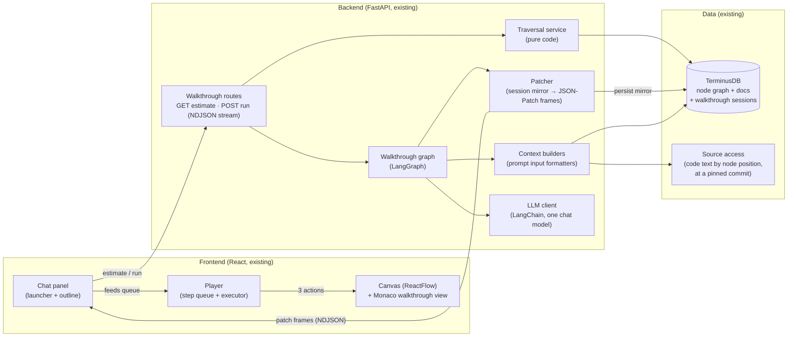
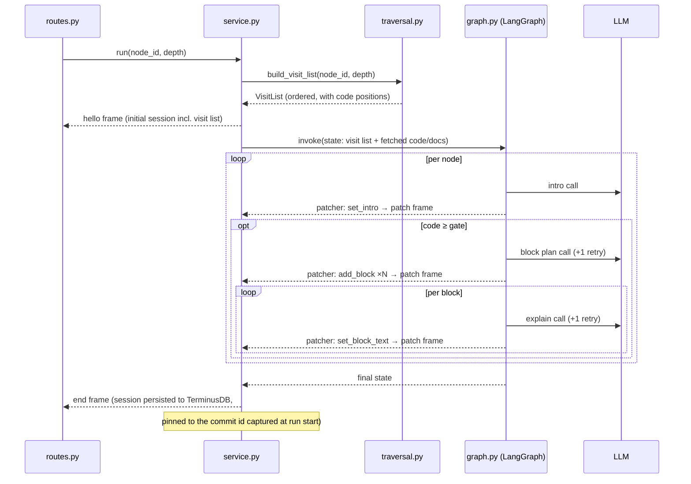

# 02 — Architecture

The big pieces and how they talk. Everything below this file zooms into one box of
this diagram.

## System picture



Boundaries worth stating out loud:

- **The frontend never talks to the LLM.** It sends one request and applies a stream
  of JSON-Patch frames to a session mirror (04). All prompt building happens
  server-side in the context builders — the frontend cannot drift out of sync with
  prompt logic.
- **The LangGraph graph never queries the database.** The traversal service and
  context builders fetch everything up front (the subtree is small — it is depth-
  bounded by design). The graph is a pure function from `(visit list, code, docs)` to
  `(block plans, texts)`. This is what keeps it deterministic and unit-testable.
- **The player never interprets LLM output.** It executes typed steps that backend
  code assembled. A malformed LLM response is caught at validation, never at render.

## Backend module layout

```
src/backend/app/walkthrough/
├── routes.py            ← GET /estimate, POST /run (NDJSON); thin, calls service
├── service.py           ← session lifecycle, stream handoff
├── patcher.py           ← session mirror + typed patch helpers + frame log (04)
├── traversal.py         ← subtree fetch by depth, visit order, estimates   (03)
├── graph.py             ← LangGraph definition: node loop + stages         (05)
├── context.py           ← formatters: outline lines, numbered code, docs   (06)
├── prompts.py           ← prompt string builders, PROMPT_VERSION           (07)
├── schemas.py           ← Pydantic models: plan, steps, session, frames    (04)
└── fallbacks.py         ← even-split, description-as-intro, focus-as-text  (05)
```

One folder, domain-named files, mirroring how this plan is split. `service.py` is the
only module routes talk to.

## Frontend module layout

```
src/frontend/src/features/Walkthrough/
├── components/
│   ├── WalkthroughPanel.tsx      ← launcher: drop target, depth, estimate  (01)
│   ├── TourOutline.tsx           ← skeleton rows + block sub-rows          (01)
│   ├── StepPopup.tsx             ← explanation card: text, Prev/Next       (09)
│   └── CodeWalkthroughView.tsx   ← Monaco wrapper: decorations + anchor    (09)
├── store/
│   └── walkthroughSlice.ts       ← session, queue, cursor, playback state  (09)
├── hooks/
│   ├── useWalkthroughStream.ts   ← SSE consumer → store                    (09)
│   └── useStepExecutor.ts        ← runs a step's actions on the canvas     (09)
└── types.ts                      ← mirrors backend schemas                 (04)
```

Reuses what exists: ReactFlow instance for pan/zoom (the old cognitive-replay plan's
`useCanvasNavigator` idea survives here), the node expansion mechanism for
`show_code`, and the tab-scoped Zustand slice pattern.

## The request lifecycle



## Cost and latency model

Everything is countable before generation:

```
containers = nodes with no code
code_small = code nodes with lines < GATE      (GATE ≈ 8)
code_big   = code nodes with lines ≥ GATE
est_blocks(n) = clamp(ceil(n.lines / 15), 2, 5)     # estimate only; LLM decides real count

LLM calls  = N_nodes                 (intros)
           + code_big                (block plans)
           + Σ est_blocks            (block texts; code_small count as 1 block, no plan call)

steps      = containers × 1
           + code nodes × (1 intro + their blocks)
```

A typical depth-2 tour (1 file, 3 classes, 8 functions, half of them big):
~12 intro calls + ~4 plan calls + ~14 text calls ≈ **30 small calls**, each with tiny
output. On GLM-4.7/Kimi-2.5 pricing this is cents; sequential wall-clock is a few
minutes, but playback starts after the **first** node (~2 calls in), so perceived wait
is seconds. Per-node generation can later be pipelined (node N+1 generates while the
user reads node N) without changing any contract.

## Decisions that keep this cheap to change later

| Future feature | What's already in place |
|---|---|
| Timed auto-play (cognitive replay) | Steps are ordered, self-contained; add durations, drive with a timer |
| Free-form questions | Reintroduce a node planner in front of traversal; visit list becomes its output — nothing downstream changes |
| Batched block texts (cost cut) | Explainer contract is "text for range"; batching is an internal change in graph.py |
| Session library UI (browse & replay old tours) | Sessions are already in TerminusDB, pinned to a commit; the UI is a list + the existing player |
