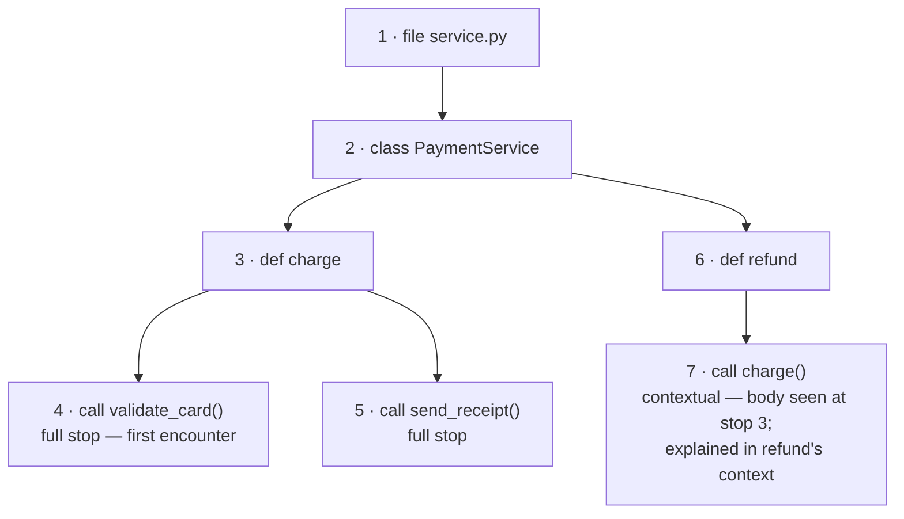

# 03 — Traversal

How a dropped node plus a depth number becomes a fixed visit list and an honest
estimate — with zero LLM involvement. This file is the "deterministic first" principle
made concrete, and it is where the graph earns its keep: **call nodes are tour stops**,
so the tour walks into callees the way a reader traces execution — something a
file-based tool cannot do without re-deriving the call graph V-NOC already stores.

## Input and output

```
build_visit_list(start_node_id, depth) → VisitList
```

- Input: one node id, one integer depth (0–3 in the UI).
- Output: an ordered list of `VisitNode` entries (see `04-data-types.md`), each knowing
  its node, its nesting level, whether it has code, its line count, and its
  **explain mode** (full or contextual — see the duplicate rule below).

The visit list is the **contract for everything downstream**: the outline event, the
step estimate, the LangGraph loop, and the player's table of contents are all views of
this one list.

## Which nodes are visited

Start from the dropped node. Walk depth-first, with these rules per node kind:

| Node kind | Rule |
|---|---|
| `function`, `class`, `call` | **Visited — these are the code stops.** A call node is treated exactly like a function or class stop: it sits on the canvas, it has a position, and it shows code (its target function's code — the IDE already handles that mapping and the code loading; the walkthrough agent resolves nothing). |
| `file` | **Visited** as a container stop (intro only; its functions/classes are their own stops). |
| `folder` | **Visited** as a container stop. |
| `project` | Only valid as a start node; treated like a folder. |
| `group` (structure/code/call groups) | **Transparent.** Never a stop; children pass through, and passing through costs no depth. Groups are a rendering artifact, not a concept the user should hear about. |

## The duplicate rule (full vs. contextual stops)

The same function can be called from many places. Track what has been explained with a
set keyed by **`target` id** — a call node's `target_function` / `target_class` id, or
the node's own id for plain function/class stops:

- **First encounter → full stop.** Intro, show code, block-by-block explanation. The
  target id enters the explained set.
- **Later encounters → contextual stop.** The call node is still selected on the
  canvas (the user sees *where* it is called), but the micro-pipeline runs **intro
  only**, with a different prompt job: explain what this call does *in the context of
  the caller* — what goes in, what comes back, why the caller needs it here. No code
  shown, no blocks. The prompt is told "the body was explained at stop N", so the text
  can say "…`charge()`, covered at stop 4, here used to retry the failed payment."
- **Recursion** falls out of the same rule: `f` calling `f` is a contextual stop.
- A call whose target is unresolved (external library, builtin) and that has no code
  of its own is also a contextual stop — explained from its name and the caller, which
  is all anyone has.

This keeps the tour honest (every call site is acknowledged) without ever explaining
the same body twice.

## Depth-first order — calls before siblings

Pre-order DFS. A code stop's children are its nested definitions **and its call
nodes, merged in source order** (`position.line_no`). The tour finishes descending
through a stop's calls before moving to its sibling — execution order, not file order.

```
visit(node):
    mode = contextual if target_id(node) in explained else full
    emit stop(node, mode)
    if mode is full:
        explained.add(target_id(node))
        for child in children(node):            # source order; groups flattened
            if level(child) ≤ depth:
                visit(child)                     # ← children AND calls, before siblings
    # contextual stops do not descend — their subtree was toured at first encounter
```



The numbering **is** the tour. No LLM ever reorders it.

## Depth counting

Depth counts **conceptual levels below the dropped node** — groups are free; call
children cost a level exactly like any child:

```
drop: def charge, depth 1

def charge                        level 0   ← full stop, blocks explained
├── call validate_card()          level 1   ← full stop
│   └── call luhn_check()         level 2   ← NOT visited (past depth)
└── call send_receipt()           level 1   ← full stop
```

Rule of thumb shown in the UI: *depth = how many hops below your node the tour
explains — into children and into calls alike.*

## The line-count gate

For each **full** code stop:

```
lines = position.end_line_no − position.line_no + 1

lines < GATE (default 8)  → single block: the whole body.  No block-planner call.
lines ≥ GATE              → block-planner call; count bounds computed from size:
                              max_blocks = clamp(floor(lines / 5), 2, 6)
                              min_blocks = 2
```

The bounds are **inputs to the prompt and to the validator** — the model is told "2 to
4 blocks" for a 20-line function and cannot pass validation outside that. Deriving
bounds from line count is what made a user-facing "min blocks" setting unnecessary and
impossible-input-proof. Contextual stops never reach the gate — they have no code
phase at all.

## The estimate (shown before Generate)

Pure arithmetic over the visit list:

```
est_blocks(node) = 0                                contextual stop or container
                 = 1                                full code stop, lines < GATE
                 = clamp(ceil(lines / 15), 2, 6)    otherwise   # midpoint guess

steps     = Σ over stops:  1 (intro)  + est_blocks(node)
llm_calls = N_stops (intros)
          + count(full code stops with lines ≥ GATE) (block plans)
          + Σ est_blocks (block texts)
```

The block count the LLM later chooses may differ from `est_blocks` by ±1–2 — the UI
labels the numbers with `~`. Stop count, order, and modes are exact.

## Data fetched during traversal (so the graph never queries)

For each stop, traversal (plus `context.py`) prefetches:

| Data | Source | Used by |
|---|---|---|
| `name`, `qname`, `description`, `node_type` | TerminusDB node | everything |
| children's `name` + `description` one-liners — including calls and children *beyond* depth | TerminusDB | intro call ("it contains X; it calls Y and Z") |
| `target` id per call node + first-explained stop number | traversal itself | duplicate rule; contextual intro ("body covered at stop N") |
| caller's name + one-line description | visit list | contextual intro ("in `refund`, this call …") |
| attached docs (`documents[]` → content) | TerminusDB | intro call (truncated, see 06) |
| code text with real line numbers | existing code loading by node id (works for call nodes too) | block plan + explainers |

Depth-bounding is also the context budget: nothing outside the visited set (plus one
level of names) is ever fetched, so prompt size is capped by construction rather than
trimmed after the fact.

## Edge cases

| Case | Behavior |
|---|---|
| Dropped node is a small function | Visit list = 1 stop, 1 block; still a valid tour |
| Recursion (`f` calls `f`) | Contextual stop via the duplicate rule |
| Two stops call the same helper | First is full, second is contextual |
| Call target in another file/folder | Normal stop — the canvas pans there; that's the feature |
| Unresolved / external call | Contextual stop (no code exists to show) |
| Empty folder / file with no code children | Visited, intro only; children line says "empty" |
| Code node missing `position` | Treated as container (intro only); logged — data bug, not user error |
| Visit list bigger than a hard cap (say 40 stops) | Estimate turns red; Generate disabled with "lower the depth" — protects cost and attention |
| `lazy_child_ids` present | Traversal resolves them server-side; canvas lazy loading does not limit the tour |
