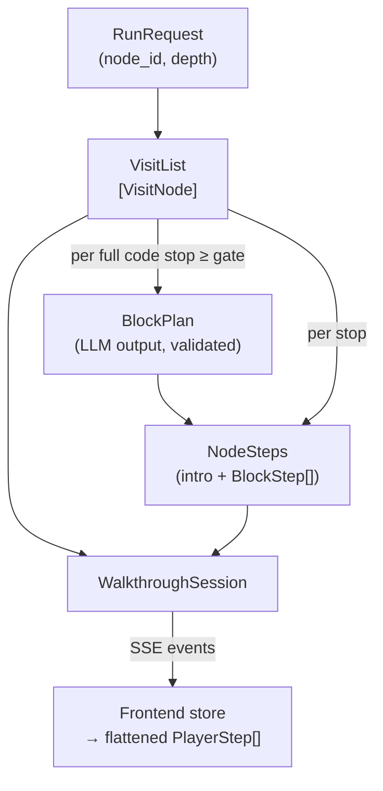

# 04 — Data Types

Every contract in one place. Backend types are Pydantic (they double as LLM output
schemas and API models); the frontend mirrors them in `types.ts`. Shapes are shown as
annotated pseudo-code — field meaning matters more than exact syntax.

## Type map



## Request and estimate

```python
class RunRequest:
    project_id: str
    node_id: str            # the dropped node
    depth: int              # 0..3 (UI range); server clamps

class Estimate:
    node_count: int         # exact (duplicate rule already applied)
    step_estimate: int      # approximate (block counts are guesses)
    llm_call_estimate: int  # approximate
    over_cap: bool          # visit list too big; Generate disabled
```

## Visit list (traversal output — the backbone)

```python
class VisitNode:
    node_id: str                         # the canvas node to select (call node id for calls)
    name: str
    qname: str | None
    node_type: Literal["folder", "file", "class", "function", "call"]
    description: str                     # stored on the graph node
    level: int                           # 0 = the dropped node
    order: int                           # position in the tour, 0-based
    parent_order: int | None             # the stop that led here (the caller, for calls)

    # ── duplicate tracking ─────────────────────────────────────────
    # Key for "has this body been explained?":
    #   call node      → its target_function / target_class id
    #   function/class → its own node id
    target_id: str | None
    mode: Literal["full", "contextual"]
    first_seen_order: int | None         # contextual only: stop where the body was
                                         # explained ("covered at stop N"); None when
                                         # the target is external/unresolved

    # ── code stops only (mode == "full") ───────────────────────────
    has_code: bool
    start_line: int | None               # position.line_no
    end_line: int | None                 # position.end_line_no
    line_count: int | None
    gated: bool                          # line_count >= GATE → block planner runs

class VisitList:
    start_node_id: str
    depth: int
    nodes: list[VisitNode]               # visit order: DFS, calls before siblings
```

### How `mode` drives everything downstream

| | `full` | `contextual` |
|---|---|---|
| Why | first time this `target_id` appears | body already explained (or nothing to show) |
| Micro-pipeline | intro → gate → block plan → block texts | **intro only**, caller-context variant |
| Intro prompt job | describe the node from outside | explain what this call does *for the caller*: inputs, result, why here; reference `first_seen_order` |
| Player steps | select → show_code → highlight × blocks | select only |
| Descends into children | yes (its subtree is toured) | **no** (subtree was toured at first encounter) |
| Counts toward estimate | intro + blocks | intro only |

The walkthrough agent never resolves a call — `node_id` is always a canvas node the
IDE can already select, expand, and load code for. Traversal only *reads* `target` to
fill `target_id`.

## Block plan (the only LLM-authored plan)

The schema bound to the block-planner call. `reasoning` comes **first** on purpose —
the model writes its reading of the code before committing to numbers (see 08).

```python
class PlannedBlock:
    start_line: int         # absolute line numbers, matching the numbered code shown
    end_line: int
    focus: str              # ≤ 100 chars: what this block is about ("validate inputs",
                            # "build the query", "handle the error path")

class BlockPlan:
    reasoning: str          # 1-3 sentences: the function's structure, where the seams are
    blocks: list[PlannedBlock]
```

**Validator rules** (code-side, after parsing):

| Rule | On violation |
|---|---|
| `min_blocks ≤ len(blocks) ≤ max_blocks` (bounds from 03) | retry with the error message |
| every range inside the node's `[start_line, end_line]` | retry |
| blocks ordered by `start_line`, non-overlapping | retry |
| blocks cover ≥ 80 % of the node's lines (no big unexplained holes) | retry |
| second failure | **fallback**: even split into `clamp(ceil(lines/15), 2, 6)` blocks, `focus = "lines A–B"` |

## Steps (assembled by code, consumed by the player)

```python
class BlockStep:
    index: int              # 0-based within the node
    start_line: int
    end_line: int
    focus: str              # from the plan (popup title)
    text: str               # explainer output; fallback: the focus line + degraded flag
    degraded: bool          # true when any fallback fired

class NodeSteps:
    node_id: str
    order: int              # mirrors VisitNode.order
    mode: Literal["full", "contextual"]
    intro_text: str         # narrator output; fallback: node.description
    degraded: bool
    blocks: list[BlockStep] # [] for containers and contextual stops;
                            # length 1 for ungated code stops
```

Nesting is intentional: a `NodeSteps` is one outline row; its `blocks` are the
sub-rows. The **player** flattens this into what it executes:

```typescript
type Action =
  | { type: "select_node";     nodeId: string }
  | { type: "show_code";       nodeId: string }
  | { type: "highlight_lines"; nodeId: string; startLine: number; endLine: number };

interface PlayerStep {
  id: string;                 // "n03" | "n03.b1"
  nodeId: string;
  actions: Action[];          // executed in order when the step becomes current
  title: string;              // node name, or block focus
  text: string;               // popup body
  degraded: boolean;
}
```

Flattening rule (fixed, in code):

```
container stop     → [ {actions: [select_node], text: intro} ]
contextual stop    → [ {actions: [select_node], text: intro} ]
full code stop     → [ {actions: [select_node], text: intro},
                       {actions: [show_code, highlight_lines(b0)], text: b0.text},
                       {actions: [highlight_lines(b1)], text: b1.text},
                       ... ]
```

(`show_code` rides on the first block's step so the intro is read against the
collapsed node — outside first, then open.)

## Session (persisted to TerminusDB)

```python
class WalkthroughSession:
    id: str
    created_at: datetime
    request: RunRequest

    # ── version pinning ─────────────────────────────────────────────
    # Captured once, at run start, before traversal. Everything in the
    # session — visit list, line numbers, code shown on playback — refers
    # to the graph AT THIS COMMIT. Replaying a session loads nodes and
    # code at this commit (TerminusDB time-travel), so highlights stay
    # correct forever, even after the code moves on.
    branch: str                          # e.g. "main"
    commit_id: str                       # TerminusDB commit at generation time

    visit_list: VisitList
    node_steps: list[NodeSteps]          # written per node_done during generation
    status: Literal["generating", "complete", "error", "aborted"]
    error_log: list[str]                 # every retry/fallback, for evals
    schema_version: str
    prompt_version: str                  # correlate quality with prompt edits
    model_id: str
    usage: TokenUsage                    # prompt/completion token totals
```

Persistence notes:

- Stored as a TerminusDB document type (`WalkthroughSessionSchema`), the same store as
  the graph itself — no new infrastructure.
- Written incrementally: the row is created at `session` time (status `generating`),
  `node_steps` append on each `node_done`, status flips at the end. A crash leaves a
  truthful partial record instead of nothing.
- **Playback contract:** the player asks for node data and code *at* `commit_id`. If
  the current canvas is on a different commit, the UI says "recorded on commit abc123
  — showing that version" rather than mis-highlighting today's lines.
- The JSON export of this object **is** the eval fixture format: re-run a stored
  session with a new prompt version and diff `node_steps` — that is the iteration loop.

## Wire protocol: NDJSON frames of JSON Patch (the Eregna patcher pattern)

There are **no named events**. The backend holds the `WalkthroughSession` as an
in-memory mirror; every mutation is expressed as RFC 6902 JSON-Patch ops against that
document and streamed as NDJSON frames. The frontend holds the same mirror and applies
the ops — one generic reducer, zero per-event code.

```
{"kind":"hello","protocol":1,"session":{...initial session incl. visit_list...}}
{"kind":"patch","seq":0,"ops":[{"op":"add","path":"/node_steps/-","value":{...NodeSteps skeleton for stop 0...}}]}
{"kind":"patch","seq":1,"ops":[{"op":"replace","path":"/node_steps/0/intro_text","value":"This class owns..."}]}
{"kind":"patch","seq":2,"ops":[{"op":"add","path":"/node_steps/0/blocks/-","value":{...BlockStep, text:""...}}]}
{"kind":"patch","seq":3,"ops":[{"op":"replace","path":"/node_steps/0/blocks/0/text","value":"The card is checked..."}]}
{"kind":"patch","seq":9,"ops":[{"op":"replace","path":"/status","value":"complete"}]}
{"kind":"end","status":"complete"}
```

Rules:

- **Envelope**: first frame is `hello` (protocol version + full initial session,
  including the visit list — the outline renders from this before any LLM call). Then
  `patch` frames with monotonic `seq`. Always a terminal `end` frame with
  `status: complete | error` (+ `message` on error).
- **Backend never writes paths by hand.** Typed patch helpers mirror the pipeline:
  `open_node_steps(order)`, `set_intro(order, text, degraded)`,
  `add_block(order, block)`, `set_block_text(order, index, text, degraded)`,
  `set_status(status)`. Helpers mutate the mirror *and* append the ops; one small
  `patcher.py`. (Eregna observes mutations with `fast-json-patch`; in Python we
  construct the ops directly — our writes are few and known.)
- **Whole values, no token streaming.** Intro and block texts arrive as complete
  strings (they are structured outputs), so MVP needs none of Eregna's string-append
  delta convention. If we later stream narration tokens, that convention is the
  documented upgrade path.
- **Persistence and wire share the mirror.** `persist` writes the same session
  document to TerminusDB that the patches describe — the stored session and the
  streamed session cannot diverge.
- **`seq` enables resume later**: a reconnecting client sends `lastSeq`, the server
  replays from the persisted session. Not built in MVP; the numbering costs nothing.

## Frontend store shape

```typescript
interface WalkthroughState {
  phase: "idle" | "estimating" | "generating" | "ready" | "playing" | "error";
  session: WalkthroughSession | null;       // the mirror; hello sets it, ops mutate it
  lastSeq: number;
  playerSteps: PlayerStep[];                // derived by flattening session.node_steps
  cursor: number;                           // current PlayerStep index, -1 = not playing
}
```

The reducer has exactly two cases: `HELLO` (set mirror) and `APPLY_PATCH`
(`applyOps(session, ops)` via `fast-json-patch` — the one new frontend package).
Outline, sub-rows, and texts all render straight off the mirror.

## Versioning

Two independent version strings, both stamped on the session:

- `SCHEMA_VERSION` — bump when `BlockPlan` / `NodeSteps` shape changes, so exported
  sessions state what shape they are.
- `PROMPT_VERSION` — bump on any prompt text change (see 07). Schema stays put.
