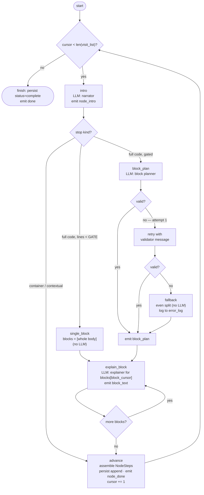

# 05 — Orchestration (LangGraph)

How the pipeline is wired as a LangGraph graph, and why a graph at all when the flow is
deterministic.

## Why LangGraph for a deterministic pipeline

Honest answer: a plain `for` loop over the visit list would work for MVP. We use
LangGraph anyway, for three practical reasons:

1. **State in one place.** The graph state object is the single source of truth while
   generating; every stage reads and writes it. No threading six variables through
   function calls.
2. **Observability for free (LangSmith).** A compiled LangGraph run shows up in
   LangSmith as **one run tree per tour**: a named span per graph node (`intro`,
   `block_plan`, `explain_block`), each LLM attempt a child run with its exact
   rendered prompt, response, latency, and token usage. Without the graph, a 35-call
   tour is 35 unrelated root traces you cannot navigate — plain LangChain calls are
   traced, but flat. When a block plan is bad, you open the tour's tree, click the
   stop, and read both attempts side by side.
3. **Room to grow without rewiring.** Free-form questions later add a planner node in
   front; pipelining (generate stop N+1 while N streams) is a concurrency change, not
   an architecture change.

What we do **not** use: agent executors, tool-calling loops, dynamic routing by the
model, or checkpointers (single-shot `ainvoke`, no resume-from-state in MVP). The
graph's edges are decided by code inspecting state — never by LLM output choosing a
route. And **retry/fallback stays inside `structured_call`**, not as graph edges:
it is a node-internal concern, and both attempts still appear as children of the
node's span in LangSmith. (An earlier revision drew retries as topology; wiring
taught us that duplicates the helper for no visibility gain.)

> **Status (2026-07-11):** the first implementation pass shipped this pipeline as a
> plain `for` loop in `pipeline.py` — a plan-code gap, not a decision. `langgraph`
> is already a dependency. `fixes/18-langgraph-orchestration.md` converts the loop
> to the graph below with **frame-for-frame identical output** (the existing
> pipeline tests are the acceptance gate).

## Graph state

```python
class WalkthroughGraphState(TypedDict):
    session_id: str
    branch: str
    commit_id: str                   # pinned at run start; all code/doc reads use it
    visit_list: VisitList            # fixed input; never mutated
    contexts: dict[int, NodeContext] # prefetched docs/child lines per stop,
                                     # keyed by visit order (06); code fields
                                     # added inside the intro node
    cursor: int                      # index into visit_list.nodes
    current_plan: BlockPlan | None   # scratch: the active stop's block plan
    block_cursor: int                # scratch: which block is being explained
    node_steps: list[NodeSteps]      # accumulating output
    error_log: list[str]
    usage: TokenUsage
```

Two side channels are injected as config, not state, so the graph stays a pure state
machine: `patcher` (typed helpers that mutate the session mirror and stream JSON-Patch
frames — see 04) and `persist` (the TerminusDB session writer, fed from the same
mirror). Where the graph diagram below says "emit X", read "call the patch helper for
X, which emits a frame".

## The graph



One iteration of the outer loop = one stop's micro-pipeline. Every diamond is a code
decision reading state; the three rectangles marked `LLM` are the only model calls.

Reading note: the `VAL` / retry diamonds are drawn to document *behavior* — in the
implementation they live **inside** the `block_plan` node (`structured_call` owns
try → retry-with-error → fallback). Graph nodes are exactly: `intro`,
`single_block`, `block_plan`, `explain_block`, `advance`.

## Node-by-node

### `intro`
- Builds the intro prompt from `contexts[node_id]` (exact contents in 06). Two prompt
  variants, chosen by code from `VisitNode.mode`:
  - **full / container** — describe the node from outside, grounded in its docs and
    trimmed code (docs when present, code alone when not — 06/07).
  - **contextual** — explain what this call does *for its caller* (inputs, result,
    why here), referencing `first_seen_order` ("covered at stop N") when it exists.
- One LLM call, schema: `{reasoning: str, intro: str}`.
- On parse/validation failure: one retry; then fallback `intro = node.description`,
  `degraded = True`. Either way the tour continues.
- Emits `node_intro` immediately — this is what makes generation feel alive.

### `block_plan`
- Only reached for full code stops past the gate. Prompt contains the numbered code
  (read at `commit_id`) and the computed bounds ("choose between 2 and 4 blocks").
- Schema: `BlockPlan` (`reasoning` first, then the committed `block_count`, then
  `blocks` — each carrying a user-facing `focus` and a model-facing `description`; 04).
- Validation per 04. First failure → retry **with the validator's message appended** —
  small models correct well when told exactly what was wrong ("block 2 ends at line 57
  but the function ends at line 52"). Second failure → deterministic even split.
- Emits `block_plan` so the outline grows sub-rows before any text exists.

### `explain_block`
- One LLM call per block — the smallest call in the system. Schema: `{text: str}`.
  The prompt includes the full code, the docs excerpt, the planner's `description` for
  this block (the steer), and the previous blocks' focus+description lines so block 3
  doesn't re-explain block 1 (06).
- Failure handling: one retry; then fallback `text = focus`, `degraded = True`.
- Emits `block_text`; loops via `block_cursor` until blocks are done.

### `advance`
- Assembles the finished `NodeSteps`, appends it to state, **persists it to the
  session document in TerminusDB**, emits `node_done`, bumps `cursor`. Pure code.
- Persisting per stop (not once at the end) means a crash or disconnect leaves a
  truthful partial session — replayable up to the last finished stop.

## LangSmith (the debugging payoff)

Tracing is **opt-in by key, zero-cost when off**, and never a code path:

- Settings gain `LANGSMITH_API_KEY: Optional[str]` and
  `LANGSMITH_PROJECT: str = "v-noc-walkthrough"`. At boot (next to
  `validate_llm_settings`), if the key is set, export `LANGSMITH_TRACING=true`,
  `LANGSMITH_API_KEY`, `LANGSMITH_PROJECT` into `os.environ` — LangChain reads the
  process env, not our `Settings` object, and pydantic-settings does **not** export
  `.env` values to `os.environ` by itself. No key → no export → tracing off, byte-
  identical behavior.
- Every tour run gets a **run name and metadata** so traces are filterable:
  `run_name=f"walkthrough {start_node_name}"`, metadata = `session_id`,
  `project_id`, `depth`, `model_id`, `prompt_version`, `schema_version`. A quality
  regression report is then: filter by `prompt_version`, open the worst tour, read
  the node spans.
- **`recursion_limit` must be set explicitly** on the run config. LangGraph's
  default is 25 super-steps; one stop consumes several (intro → plan → N block
  explains → advance), so any real tour blows past 25 and dies mid-stream with
  `GraphRecursionError`. Size it from the estimate:
  `recursion_limit = node_count * 10 + 50` — generous, because hitting it is a
  hard abort, and real cost control is the visit cap (03), not this.
- The patcher and code_service ride in `config["configurable"]`, never in state —
  state stays JSON-ish (LangSmith records it; a live object in state would be
  serialized garbage in every trace).

## Failure policy (uniform — memorize once)

```
every LLM call:  try → validate
                 fail 1 → retry once, appending the exact validator error
                 fail 2 → deterministic fallback + degraded flag + error_log entry
never:           abort the tour because of one bad call
fatal only:      DB/source unreachable, model auth/quota → persist status=error, SSE error
```

This is the small-model contract: assume every call *can* fail and make failure boring.

## Model configuration

- **One chat model for all three call types**, configurable id (GLM-4.7, Kimi 2.5,
  anything OpenAI-compatible) via LangChain `init_chat_model`. A per-call-type
  override is a config field we leave room for but build no UI for.
- `temperature 0.2` for block plans (structure should be stable), `0.5` for intros and
  block texts (prose can breathe).
- Structured output via `with_structured_output`, JSON mode preferred for these
  providers. Known provider quirks to guard against (documented in Eregna v2's fixes
  folder): disable parallel tool calls, avoid optional fields in strict schemas, and
  never let reasoning tokens leak into the JSON channel.
- **No `max_tokens` on any call** — deliberate. Reasoning models spend a completion
  cap on hidden thinking before writing a word of content (observed live: a 700 cap
  consumed entirely by reasoning tokens, empty output, every intro degraded). Length
  is steered by the prompts ("aim for 2–4 sentences" — a target, not a limit); cost
  control is the estimate + over-cap gate (03). If a provider's own hard limit ever
  cuts a response, the JSON fails to parse and takes the normal retry → fallback
  path (backend/02).

## Ordering and concurrency

MVP runs strictly sequential — simplest to reason about, and SSE order matches visit
order for free. Two later upgrades, both invisible to the frontend contract:

- **Pipelining:** run stop N+1's `intro` while stop N's blocks are explaining. Events
  per stop stay ordered; interleaving across stops is already legal for the store,
  which keys everything by `node_id`.
- **Batching block texts:** collapse the `explain_block` loop into one call per stop
  with an array schema — a cost cut, kept behind a flag until eval'd against
  per-block quality.
