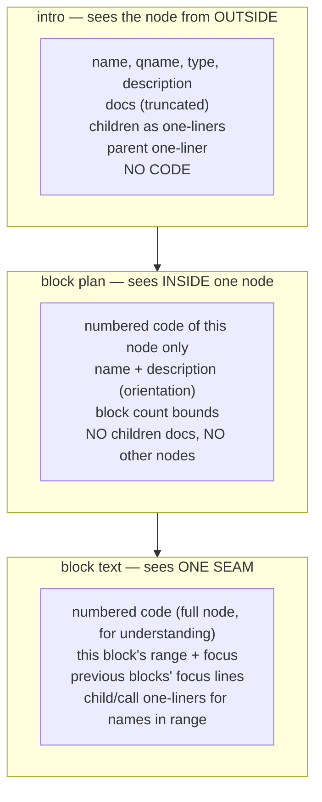

# 06 — Context Engineering

What data goes into each LLM call, why, and what never goes in. This is where quality
is actually won on small models: not smarter prompts — smaller, better-chosen context.

## The principle

Every call gets **exactly one screen of context**: everything it needs to do its one
job, and nothing that belongs to a different zoom level. The three calls sit at three
zoom levels:



All reads happen at the session's pinned `commit_id`. Context is assembled by
`context.py` into a `NodeContext` per stop **before** the graph runs — the graph never
fetches.

## `NodeContext` (prefetched per stop)

```python
class NodeContext:
    node_id: str
    header: str          # "function charge — payments/service.py · lines 10-62"
    description: str
    docs_excerpt: str    # attached documents, concatenated, hard-capped (~600 tokens)
    parent_line: str     # "in class PaymentService — orchestrates payment flow"
    child_lines: list[str]   # "· validate_card (function) — checks card fields"
                             # includes calls and beyond-depth children; capped at 20,
                             # then "…and 7 more"
    caller_line: str | None  # contextual stops: the caller's one-liner
    first_seen_ref: str | None  # contextual: "explained at stop 4 (validate_card)"
    numbered_code: str | None   # full code stops: code with REAL line numbers
    tour_position: str   # "stop 5 of 12; previous: charge (function)"
```

## What each call receives

| Context piece | intro (full) | intro (contextual) | block plan | block text |
|---|---|---|---|---|
| header, description | yes | yes | yes | yes |
| docs_excerpt | yes | — | — | — |
| parent_line | yes | — | — | — |
| child_lines | yes | — | — | only names appearing in the block's range |
| caller_line + first_seen_ref | — | yes | — | — |
| numbered_code | — | — | yes | yes |
| block bounds (min/max) | — | — | yes | — |
| this block's range + focus | — | — | — | yes |
| previous blocks' focus lines | — | — | — | yes |
| tour_position | yes | yes | — | — |

Reading the table row by row is the design:

- **Docs go to the intro only.** Docs describe purpose and usage — outside-view
  material. Feeding them to the explainer invites it to paraphrase docs instead of
  reading code.
- **Children are one-liners everywhere, never code.** The intro says what's inside by
  name; the block text can name a callee ("delegates to `validate_card`, next stop")
  because it gets the one-liner for names visible in its range. Nobody ever sees a
  child's body — that child has its own stop.
- **The explainer gets the whole node's code but one block's assignment.** Small
  models explain a range badly without surrounding code (they guess); with the full
  node plus "explain lines 23–31 only", they stay grounded and stay put.
- **Previous focus lines prevent repetition** across per-block calls — one line each,
  not the full previous texts (which would grow the prompt quadratically).
- **tour_position gives the narrator continuity** ("we just left charge()") for one
  sentence of flow, without shipping any previous stop's content.

## Formats (exact)

**Numbered code** — real line numbers, right-aligned, inside a plain fence:

```
  10 | def charge(self, card: Card, amount: int) -> Receipt:
  11 |     """Charge a card and return a receipt."""
  12 |     self._validate(card)
  ...
  62 |     return receipt
```

Real (absolute) numbers matter: the block plan's output ranges are validated against
`[10, 62]`, and the frontend highlights the same numbers Monaco shows. No mapping step,
no off-by-one class of bugs.

**Child lines** — one line, name + type + description, depth-indented one level max:

```
· validate_card (function) — checks number, expiry and cvv format
· send_receipt (function) — emails the receipt, retries twice
· PaymentError (class) — raised on any provider failure
```

**Docs excerpt** — first N chars of each attached doc under a `### doc: <title>`
header, total cap ~600 tokens. Truncation marker `[…]` so the model knows it is
partial and doesn't treat the cut as the end of a sentence.

## Token budgets (per call, input side)

| Call | Typical | Cap | Cap mechanism |
|---|---|---|---|
| intro | 400–800 | ~1.5k | child_lines ≤ 20, docs ≤ 600 tok |
| block plan | code + ~200 | ~2.5k | node code is naturally bounded; functions > ~150 lines get max_blocks=6 and that's that |
| block text | code + ~300 | ~3k | same code bound + one-liners only |

No call ever needs trimming logic at runtime — the caps hold **by construction**
(depth-bounded traversal, one-liner children, doc cap). That is the payoff of
assembling context from the graph instead of searching for it.

## What never goes into any prompt

| Excluded | Why |
|---|---|
| Other stops' code | Each node has its own stop; cross-node reading invites drift and blows budgets |
| Full previous explanations | Focus one-liners carry the continuity at 1/20th the tokens |
| File paths beyond the header line | The canvas shows location; the text shouldn't narrate paths |
| The visit list / tour plan JSON | The model doesn't drive the tour; it doesn't need the map |
| Anything at a different commit | Session is pinned; mixing versions corrupts line numbers |
| User identity, project settings | Not needed for any of the three jobs |

## Where a "prompt builder" could live later

The frontend-configurable prompt builder idea (user tweaks tone/audience per tour) is
deliberately post-MVP, but the seam exists: every prompt is built from `NodeContext` +
a template in `prompts.py`. A later "tone overlay" is one extra string slotted into the
system prompt — same pattern as Eregna's customer overlay, sandwiched between our rules
so it can adjust voice but not the output contract.
