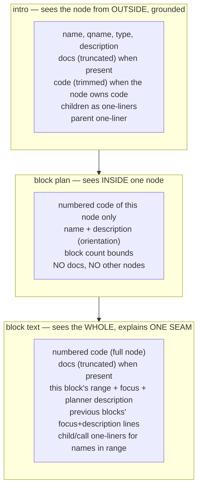

# 06 — Context Engineering

What data goes into each LLM call, why, and what never goes in. This is where quality
is actually won on small models: not smarter prompts — smaller, better-chosen context.

> **Revision 2 (2026-07-11), in step with 07.** The intro now receives docs **and**
> trimmed code (code alone when no docs exist); the block text now receives docs
> alongside the full code; the block plan hands each block a one-sentence
> `description` that flows into the block-text calls. Rationale for each change is in
> 07 Part 3 — this file records the resulting data contract.

## The principle

Every call gets **exactly one screen of context**: everything it needs to do its one
job, and nothing that belongs to a different zoom level. The three calls sit at three
zoom levels:



The zoom levels did not move in revision 2 — what moved is the *grounding*: the
outside view (intro) and the seam view (block text) both get the evidence they narrate
from, while the structural decision (block plan) stays code-only.

One thing that is **prompt, not context**: the domain glossary (what a node kind is,
what the three group kinds are). It is a stable constant in the system prompt (07
layer 2), never assembled per stop — do not put it in `NodeContext`.

All reads happen at the session's pinned `commit_id`. Context is assembled by
`context.py` into a `NodeContext` per stop **before** the graph runs — the graph never
fetches. (Practically: the service builds all contexts right after the visit list,
while the traversal graph and repos are still in scope.)

## `NodeContext` (prefetched per stop)

```python
class NodeContext:
    node_id: str
    header: str          # "function charge — payments/service.py · lines 10-62"
    description: str
    docs_excerpt: str    # attached documents, concatenated, hard-capped (~600 tokens);
                         # "" = node has no docs → the section is omitted (07)
    parent_line: str     # "in class PaymentService — orchestrates payment flow"
    child_lines: list[str]   # "· validate_card (function) — checks card fields"
                             # groups flattened, provenance kept (see Formats);
                             # includes calls and beyond-depth children; capped at 20,
                             # then "…and 7 more"
    caller_line: str | None  # contextual stops: the caller's one-liner
    first_seen_ref: str | None  # contextual: "explained at stop 4 (validate_card)"
    numbered_code: str | None   # full code stops: code with REAL line numbers
    intro_code: str | None      # trimmed variant for the intro (see Formats)
    tour_position: str   # "stop 5 of 12; previous: charge (function)"

    # block-text call only (copied per block from the validated plan)
    block_focus: str | None
    block_description: str | None       # the planner's one-sentence note
    block_start: int | None
    block_end: int | None
    previous_block_lines: list[str]     # "lines 10-22: validate input — Checks…"
```

## What each call receives

| Context piece | intro (full) | intro (contextual) | block plan | block text |
|---|---|---|---|---|
| header, description | yes | yes | yes | header only |
| docs_excerpt | yes | — | — | yes |
| parent_line | yes | — | — | — |
| child_lines | yes | — | — | only names appearing in the block's range |
| caller_line + first_seen_ref | — | yes | — | — |
| intro_code (trimmed) | yes | — | — | — |
| numbered_code (full) | — | — | yes | yes |
| block bounds (min/max) | — | — | yes | — |
| this block's range + focus + description | — | — | — | yes |
| previous blocks' focus+description lines | — | — | — | yes |
| tour_position | yes | yes | — | — |

Reading the table row by row is the design:

- **Docs go where meaning is narrated, not where structure is decided.** The intro and
  the block text are the two user-facing narrations — they get docs (intent). The
  block plan makes one structural decision — seams live in code, so it gets none
  (docs tempt doc-shaped splits the validator then rejects; 07 Part 3).
- **The intro's grounding ladder:** docs when present are the authority for *what*;
  code (trimmed) is the evidence — and the only grounding when docs are absent, which
  on real projects is most nodes. The prompt keeps the zoom ("from outside"); the
  context just stops being empty. Contextual stops keep the lean caller-view — the
  call's target was or will be explained elsewhere.
- **Children are one-liners everywhere, never code.** The intro says what's inside by
  name; the block text can name a callee ("delegates to `validate_card`, next stop")
  because it gets the one-liner for names visible in its range. Nobody ever sees a
  child's body — that child has its own stop.
- **The explainer gets the whole node's code but one block's assignment.** Small
  models explain a range badly without surrounding code (they guess); with the full
  node plus "explain lines 23–31 only", they stay grounded and stay put. The planner's
  `block_description` rides along as the steer — the one call that read the whole
  structure briefs the calls that didn't.
- **Previous focus+description lines prevent repetition** across per-block calls —
  one line each, not the full previous texts (which would grow the prompt
  quadratically).
- **tour_position gives the narrator continuity** ("we just left charge()") for one
  sentence of flow, without shipping any previous stop's content.

## Formats (exact)

**Numbered code** — real line numbers, right-aligned, inside a plain fence:

```
  10 | def charge(self, card: Card, amount: int) -> Receipt:
  11 |     """Charge a card and return a receipt."""
  12 |     self._validate(card)
  ...
  62 |     return receipt
```

Real (absolute) numbers matter: the block plan's output ranges are validated against
`[10, 62]`, and the frontend highlights the same numbers Monaco shows. No mapping step,
no off-by-one class of bugs.

**Intro code trim** — the intro is an outside view; it needs enough code to be honest,
not all of it. `intro_code` is the full numbered code when the node is ≤ 80 lines;
otherwise the first 60 numbered lines plus a marker:

```
  70 |     ...
[… trimmed: 74 more lines, through line 144]
```

The marker names the real end line so the model never mistakes the cut for the end of
the function. The block plan and block text always get the **untrimmed**
`numbered_code` — their job is the inside.

**Child lines** — one line, name + type + description; when traversal pulled the child
through a group, the group's name is kept as provenance (the glossary in 07 tells the
model what that means):

```
· validate_card (function) — checks number, expiry and cvv format
· send_receipt (function, grouped under "Notifications") — emails the receipt
· PaymentError (class) — raised on any provider failure
```

Groups are flattened by traversal (they are canvas organization, not code — 03), so a
group never appears as a child line itself; it survives only as that annotation.

**Docs excerpt** — first N chars of each attached doc under a `### doc: <title>`
header, total cap ~600 tokens (≤ 3 docs per node, first ones win). Truncation marker
`[…]` so the model knows it is partial and doesn't treat the cut as the end of a
sentence. Empty (`""`) means "omit the section", never "show an empty section" (07).

**Previous block lines** — the plan's own words, one line per finished block:

```
lines 10-22: validate the card fields — Rejects bad numbers and expired dates early.
lines 23-41: build the provider request — Maps our Card onto the PSP's wire format.
```

## Token budgets (per call, input side)

| Call | Typical | Cap | Cap mechanism |
|---|---|---|---|
| intro | 600–1200 | ~2.5k | intro_code trim (≤ 80 lines), docs ≤ 600 tok, child_lines ≤ 20 |
| block plan | code + ~200 | ~2.5k | node code is naturally bounded; functions > ~150 lines get max_blocks=6 and that's that |
| block text | code + ~500 | ~3.5k | same code bound + docs ≤ 600 tok + one-liners only |

No call ever needs trimming logic at runtime — the caps hold **by construction**
(depth-bounded traversal, the intro trim rule, one-liner children, doc cap). That is
the payoff of assembling context from the graph instead of searching for it.

(Output side: the block plan emits `block_count` + a full-sentence `description` per
block. **No call sets `max_tokens`** — reasoning models spend completion caps on
hidden thinking before any content, so caps were removed entirely; length is a
prompt-stated target ("aim for 2–4 sentences"). Recorded in backend/02.)

## What never goes into any prompt

| Excluded | Why |
|---|---|
| Other stops' code | Each node has its own stop; cross-node reading invites drift and blows budgets |
| Full previous explanations | Focus+description one-liners carry the continuity at 1/20th the tokens |
| File paths beyond the header line | The canvas shows location; the text shouldn't narrate paths |
| The visit list / tour plan JSON | The model doesn't drive the tour; it doesn't need the map |
| Anything at a different commit | Session is pinned; mixing versions corrupts line numbers |
| Group nodes as subjects | Groups are canvas organization; traversal flattens them — they surface only as `grouped under "X"` provenance, defined once in the glossary (07) |
| User identity, project settings | Not needed for any of the three jobs |

## Where a "prompt builder" could live later

The frontend-configurable prompt builder idea (user tweaks tone/audience per tour) is
deliberately post-MVP, but the seam exists: every prompt is built from `NodeContext` +
a `ChatPromptTemplate` in `prompts.py`. A later "tone overlay" is one extra string
slotted into the system prompt — same pattern as Eregna's customer overlay, sandwiched
between our rules so it can adjust voice but not the output contract.
