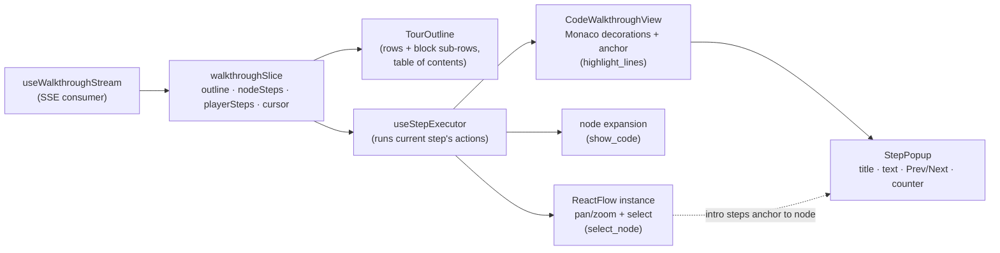
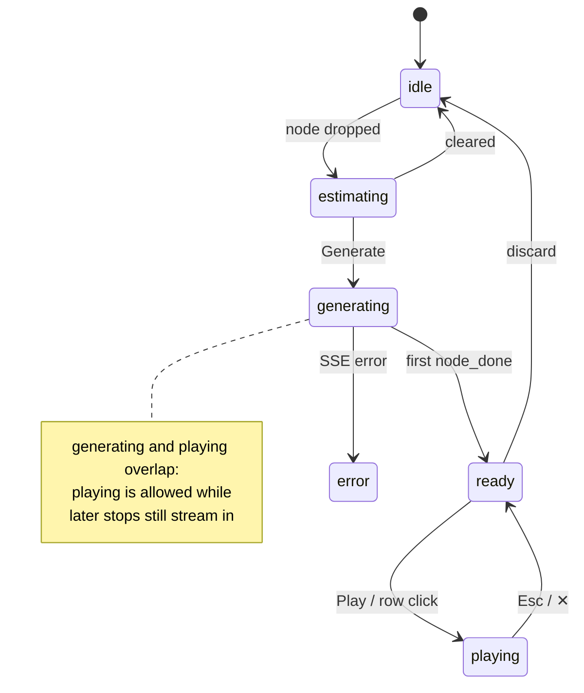

# 09 — Frontend Playback

The player, the custom Monaco walkthrough view, and how the three actions land on the
existing canvas. Everything here consumes the typed steps from 04 — no LLM output is
ever interpreted on the frontend.

## Pieces and data flow



## The step executor

One hook, one job: make the canvas match `playerSteps[cursor]`.

```
on cursor change:
  step = playerSteps[cursor]
  for action in step.actions:          # order matters, fixed by flattening (04)
    select_node     → rfInstance.setCenter(node, {zoom, duration 500})
                      + mark node active in the project store
    show_code       → expand node via existing toggleNodeExpansion
    highlight_lines → set {nodeId, startLine, endLine} in the slice;
                      CodeWalkthroughView reacts
  then StepPopup renders step.title / step.text anchored per step kind
```

Two rules learned from the cognitive-replay draft, kept:

- **User interaction pauses driving.** If the user pans/zooms manually
  (`onMoveStart` while a step is active), the executor stops re-centering until the
  next `Next` click. The tour must never fight the mouse.
- **Steps are re-executable.** `Prev` doesn't "undo" — it just executes the previous
  step, which re-centers, re-expands, re-highlights. Idempotent actions make Prev free.

## CodeWalkthroughView (the custom Monaco component)

A thin wrapper around the existing read-only Monaco code view of an expanded node,
adding a walkthrough mode:

- **Highlight**: one `deltaDecorations` set — full-line background class
  (`.walkthrough-line`) over `startLine..endLine`, plus a left gutter bar. Colors via
  CSS so themes keep working. Previous decoration set is replaced, never accumulated.
- **Dimming**: lines outside the block get a `.walkthrough-dim` opacity class — the
  block reads as "lit" rather than merely marked. (One decoration covering the whole
  range with `inlineClassName` off; cheap.)
- **Reveal**: `revealLinesInCenterIfOutsideViewport(startLine, endLine)` on step
  enter — smooth-scrolls inside the editor while ReactFlow has already centered the
  node itself.
- **Popup anchor**: a Monaco **content widget** pinned to `endLine` (below-right of
  the block). Content widgets track scroll/resize for free — no manual math. The
  StepPopup portal renders into it.
- **Line mapping**: block line numbers are absolute file lines; the node's editor
  shows the node's slice starting at `position.line_no`. The view owns the single
  conversion `editorLine = absLine − node.start_line + 1` — the only place in the
  system where line numbers are translated. On replay of an old session, code is
  loaded at the session's pinned `commit_id`, so the mapping stays exact.

```
┌───────────────────────────────────────────────┐
│  def charge(self, card, amount):        10    │  ← dimmed
│      self._validate(card)               12    │  ██ highlighted block
│      token = provider.tokenize(card)    13    │  ██
│      ...                                      │  ← dimmed
│                 ┌─────────────────────────────┴──┐
│                 │ Validate before charging       │ ← StepPopup (content widget)
│                 │ The card is checked first so … │
│                 │  ⚠︎ degraded?   3/9  ◀ Prev Next ▶ │
│                 └────────────────────────────────┘
└───────────────────────────────────────────────┘
```

## StepPopup

- Title = node name (intro steps) or block `focus` (block steps). Body = `text`.
- `Next / Prev` buttons + `k / j`-style arrow-key bindings + step counter.
- `degraded` renders a small ⚠ with tooltip "fallback text" — honest UI beats silent
  mediocrity, and it doubles as a live eval signal while dogfooding.
- Intro steps (container/contextual stops have no Monaco) anchor the same popup to the
  canvas node via a ReactFlow-space overlay positioned from the node's rect.

## TourOutline (in the chat panel)

- Renders from `outline` immediately: one row per stop (indented by `level`, calls
  prefixed with `↳`), grey while pending.
- `block_plan` adds sub-rows ("validate the card fields · 12–18"); `block_text` /
  `node_intro` fill them in; `node_done` checkmarks the row.
- Rows are the table of contents: click → `cursor = firstStepIndex(row)`.
- Contextual stops render with a link glyph to their `first_seen_order` row.

## Playback of saved sessions

Same player, different source: load a `WalkthroughSession` from the backend instead of
consuming SSE. Because the session pins `branch` + `commit_id`, the loader fetches node
data and code **at that commit**; if the canvas currently shows a newer commit, a
banner says "recorded at abc123 — showing that version". No drift handling needed —
old sessions are simply played against old code, which TerminusDB gives us for free.

## State machine (slice level)



The only subtle state: `playing` while `generating`. `Next` past the last available
step shows a small "generating…" shimmer in the popup instead of advancing — the queue
catches up, the button unlocks.

## Reuse map (what we do NOT build)

| Need | Existing thing |
|---|---|
| Pan/zoom to node | ReactFlow `setCenter` (the old `useCanvasNavigator` sketch from cognitive-replay) |
| Expand node code | `toggleNodeExpansion` in the project store |
| Node selection ring | existing selection state (`handleNodeSelection`) |
| Monaco instance per node | existing expanded-node code view |
| Tab-scoped state | existing Zustand slice pattern |
