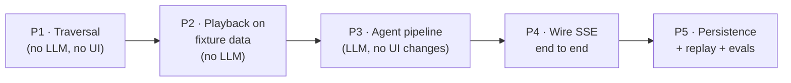

# 10 — Implementation Steps

Build order in five phases. Each phase ends with something runnable and demoable —
three of them don't need an LLM key at all. Later phases never rework earlier ones;
they only add.

## Phase map

The unusual choice — **playback before agent** — is deliberate: a hand-written fixture
session exercises every frontend piece with zero API cost, and the fixture format
doubles as the eval fixture format later. The agent then has a working screen to land
in, instead of debugging prompts against a UI that doesn't exist yet.

## Phase 1 — Traversal (backend, pure code)

1. `schemas.py`: `VisitNode`, `VisitList`, `Estimate` (04).
2. `traversal.py`: subtree walk with group flattening, call stops, duplicate rule
   (full/contextual), depth counting, visit order (03).
3. Line-count gate + bounds + estimate arithmetic.
4. Route: `GET /walkthroughs/estimate?node_id&depth`.
5. **Tests carry this phase**: order, depth, calls-before-siblings, visited-once,
   recursion, groups-are-free, over-cap — all pure functions, all cheap to test.

✅ Demo: curl the estimate for real project nodes; eyeball visit lists.

## Phase 2 — Playback on fixture data (frontend, no LLM)

1. `types.ts` mirroring 04; a hand-written `WalkthroughSession` fixture for a small
   real node (write it by hand — doing so pressure-tests the types).
2. `walkthroughSlice` + flattening (`NodeSteps` → `PlayerStep[]`).
3. `useStepExecutor`: the three actions on the existing canvas.
4. `CodeWalkthroughView`: decorations, dimming, reveal, content-widget anchor, the
   one line-mapping formula.
5. `StepPopup` + `TourOutline` + `WalkthroughPanel` (drop target, depth picker,
   estimate display wired to the P1 endpoint).

✅ Demo: full click-through tour of fixture data on the real canvas. This is the
"does it feel right" gate — iterate on the *feel* here, before any token is spent.

## Phase 3 — Agent pipeline (backend, LLM, testable without frontend)

1. `context.py`: `NodeContext` prefetch (code at pinned commit, docs excerpt, child
   one-liners) (06).
2. `prompts.py`: the four prompt builders + `PROMPT_VERSION` (07).
3. `schemas.py`: `BlockPlan` + validators + `NodeSteps` (04).
4. `graph.py`: LangGraph pipeline — intro → gate → block_plan (retry→fallback) →
   explain_block loop → advance (05). `emit`/`persist` as injected no-ops for now.
5. `fallbacks.py`: even split, description-as-intro, focus-as-text.
6. CLI harness: `python -m app.walkthrough.run <node_id> <depth>` → prints the
   session JSON. Iterate prompts here, with the model you'll actually use (GLM/Kimi),
   against real nodes.

✅ Demo: readable, correctly-split walkthrough JSON for a real function, twice in a
row (stability check), with fallbacks provably firing on induced failures.

## Phase 4 — Wire it end to end

1. `service.py`: session lifecycle, SSE emitter, `POST /walkthroughs/run` (02).
2. `useWalkthroughStream`: SSE → store (events from 04).
3. Outline skeleton fills live; play-while-generating; "generating…" shimmer at the
   queue edge; degraded ⚠ rendering.
4. Abort on disconnect (cancel the in-flight LLM call, mark session `aborted`).

✅ Demo: drop node → estimate → Generate → watch outline fill → click through the
tour while later stops still stream. **This is the MVP.**

## Phase 5 — Persistence, replay, evals

1. TerminusDB doc type for `WalkthroughSession`; create at start, append per
   `node_done`, finalize status (04). Stamp `branch` + `commit_id` at run start.
2. Replay path: load session → fetch nodes/code **at the pinned commit** → same
   player; "recorded at abc123" banner when canvas commit differs.
3. Session JSON export; keep 5–10 as eval fixtures.
4. Eval script: re-run fixtures on a prompt change; report validator first-pass rate,
   length bounds, banned-phrase greps, sibling-block n-gram overlap (07).

✅ Demo: replay yesterday's tour after editing the code — highlights still correct.

## Definition of done (MVP)

- [ ] Estimate is exact on nodes/order, honest (~) on steps/calls, and blocks
      over-cap subtrees.
- [ ] Tour generates for: one function · class with methods · file · folder with
      call-outs to another file · node with recursion (contextual stop).
- [ ] No single LLM failure ever kills a tour (kill the network mid-run to prove it).
- [ ] Play-while-generating works; Prev is idempotent; Esc always frees the canvas.
- [ ] Highlights match blocks exactly on canvas Monaco (line-mapping formula tested).
- [ ] Session lands in TerminusDB pinned to its commit; replay after a code edit
      shows the old version correctly.
- [ ] `PROMPT_VERSION` / `SCHEMA_VERSION` stamped; eval script runs on fixtures.

## Deferred (tracked, not forgotten)

| Item | Trigger to build it |
|---|---|
| Node planner + free-form questions | Users ask "explain how X works" instead of dropping nodes |
| Auto-play / timeline (cognitive replay UI) | Click-through feels limiting in dogfooding |
| Batched block texts | Cost per tour matters at real usage volume |
| Pipelined generation | Users outpace generation regularly |
| Tone/audience overlay (prompt builder UI) | First external user asks for it |
| Session library UI | More than ~10 saved sessions exist |
