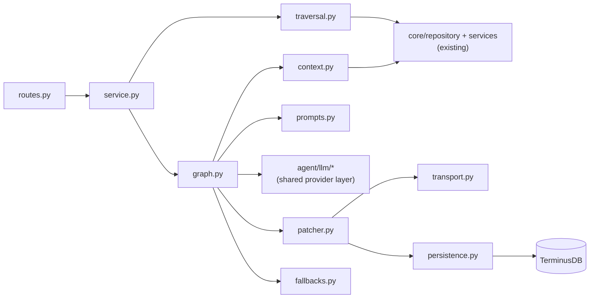

# 01 — Folder Structure

Where every new file goes. Two locations: the shared provider layer takes its
reserved seat in `app/agent/llm/` (the folders exist, empty); everything
walkthrough-specific is one self-contained package in `app/walkthrough/`.

## New files

```
src/backend/app/
├── agent/
│   └── llm/                            ← SHARED: future chat agent uses this too
│       ├── __init__.py                 ← exports make_chat, structured_call
│       ├── providers.py                ← the registry: openai/vercel/custom/fake (02)
│       ├── factory.py                  ← make_chat(call_type) → ChatOpenAI (02)
│       ├── structured.py               ← structured_call(): schema-bound invoke,
│       │                                  retry-with-error, fallback hook (02)
│       └── fake.py                     ← FakeChatModel: canned outputs, no network (05)
│
└── walkthrough/
    ├── __init__.py
    ├── routes.py                       ← estimate · run · get-by-id; thin (03)
    ├── service.py                      ← session lifecycle, lock, stage handoff (03)
    ├── schemas.py                      ← Pydantic: VisitNode/List, BlockPlan,
    │                                      NodeSteps, Session, frames (parent 04)
    ├── traversal.py                    ← visit list, gate, estimate (parent 03)
    ├── context.py                      ← NodeContext prefetch + formatters (parent 06)
    ├── prompts.py                      ← 4 prompt builders + PROMPT_VERSION (parent 07)
    ├── graph.py                        ← LangGraph pipeline (parent 05)
    ├── patcher.py                      ← session mirror + typed helpers + frame log (03)
    ├── transport.py                    ← NDJSON StreamingResponse writer (03)
    ├── fallbacks.py                    ← even split, description-as-intro, focus-as-text
    ├── persistence.py                  ← TerminusDB session repo (04)
    └── cli.py                          ← python -m app.walkthrough.cli <node> <depth> (05)
```

## Existing files we touch (short on purpose)

| File | Change |
|---|---|
| `app/config/settings.py` | Add the `WALKTHROUGH_LLM_*` fields (02) |
| API router registration (where `code_routes` etc. are included) | `include_router(walkthrough.routes.router, prefix="/walkthroughs")` |
| `app/db/schema/` | Add `WalkthroughSessionSchema` doc type (04) |
| `pyproject.toml` | The four dependencies (00) |

Nothing else. Specifically **not touched**: existing repositories and services (we
call them, never modify), the parser/watcher core, socket code.

## Conventions followed (house style, observed in the codebase)

- Pydantic models for every boundary (`schemas.py`), same as `api/schemas` and the
  `conversations` package.
- Services own orchestration, repositories own DB access; routes stay thin — matches
  `core/services/` ↔ `core/repository/`.
- Settings via `pydantic-settings` with env defaults, accessed through
  `get_settings()` — never `os.environ` in feature code.
- loguru for logging; every retry/fallback logs one structured line (they feed
  `error_log` on the session too).
- Async endpoints; the LangGraph pipeline runs async (`ainvoke`), LLM calls through
  LangChain's async client.

## Dependency direction (keep it one-way)



`agent/llm/` imports nothing from `app/walkthrough/` — it must stay reusable for the
future chat agent. `graph.py` never imports routes or transport; it only sees the
injected patcher/persist callables (parent 05).
