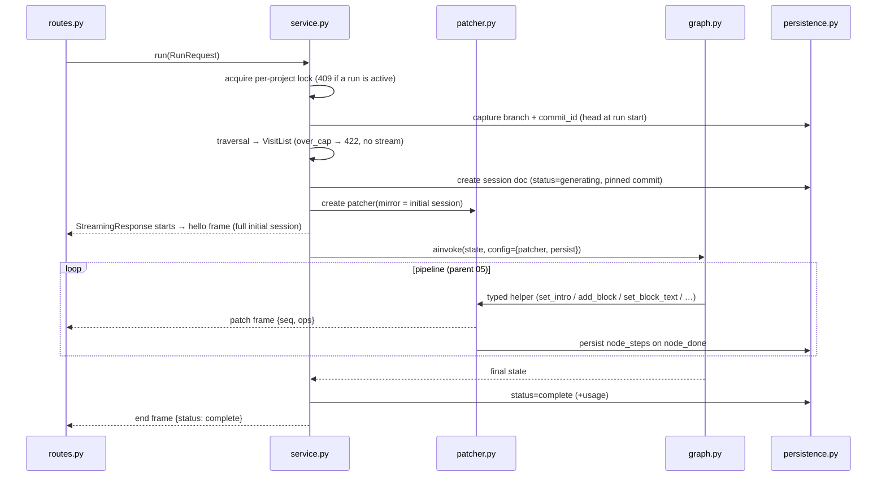

# 03 — Routes, Service, Patcher, Transport

The HTTP surface and the plumbing between the LangGraph pipeline and the wire.

## Endpoints

```
GET  /api/v1/walkthroughs/estimate?project_id&node_id&depth
     → Estimate (parent 04). Pure traversal; no LLM, no session, cacheable.

POST /api/v1/walkthroughs/run
     body: RunRequest {project_id, node_id, depth}
     → application/x-ndjson stream: hello · patch* · end   (parent 04)

GET  /api/v1/walkthroughs/{session_id}
     → the persisted WalkthroughSession document (replay path, frontend 02)
```

Router registered like every other domain router (`walkthroughs` prefix). Routes stay
thin: parse → service → response.

## The run lifecycle (service.py)



Failure exits from the same diagram:

| Event | Behavior |
|---|---|
| Client disconnects | FastAPI cancels the generator → `CancelledError` propagates into the pipeline, in-flight LLM call cancelled → session `aborted`. No `end` frame (nobody listening); the doc is truthful |
| Fatal error (DB down, provider auth/quota) | `end {status:"error", message}` + session `error`; partial `node_steps` already persisted stay |
| Non-fatal LLM failures | Never reach here — `structured_call` + fallbacks absorb them (02); they only mark `degraded` and append to `error_log` |

The per-project asyncio lock is MVP concurrency control: one generation per project at
a time; a second `POST /run` gets `409` with the active session id (frontend shows the
confirm-discard flow it already has).

## patcher.py — mirror + typed helpers + frames

The Python version of Eregna's patcher, simplified because our writes are few and
known — we **construct** ops directly instead of observing mutations:

```python
class Patcher:
    def __init__(self, session: WalkthroughSession, emit: Callable[[dict], Awaitable]):
        self.mirror = session
        self.emit = emit          # writes one NDJSON line
        self.seq = 0
        self.log: list[dict] = [] # frame log — becomes the recorded fixture (05)

    async def _frame(self, ops: list[dict]):
        # apply to mirror (jsonpatch) → keep mirror as the single truth,
        # then emit {kind:"patch", seq, ops} and append to log
```

Typed helpers (the pipeline's only mutation surface, parent 04): `open_node_steps`,
`set_intro`, `add_block`, `set_block_text`, `mark_node_done`, `set_status`. Each is a
few lines: build ops → `_frame(ops)`. Paths are built by helpers only — `graph.py`
never writes a JSON pointer by hand.

Because ops are applied to the mirror through `jsonpatch`, the mirror can never
diverge from what the frontend reconstructs — same-input, same-document by
construction, and `persistence.py` saves that same mirror.

## transport.py — NDJSON writer

```python
async def ndjson_stream(gen: AsyncIterator[dict]) -> StreamingResponse:
    async def lines():
        async for frame in gen:
            yield orjson.dumps(frame) + b"\n"
    return StreamingResponse(lines(), media_type="application/x-ndjson")
```

Frames flow through an `asyncio.Queue` between the pipeline task and the response
generator, so slow clients don't stall LLM calls (bounded queue; if a client is
pathologically slow, backpressure is acceptable). ~40 lines including the queue.

## Estimate endpoint details

- Runs `build_visit_list` and the arithmetic from parent 03; returns exact node count
  and `~` step/call estimates.
- Validates the node exists and is a legal start kind; 404/422 otherwise.
- No session, no lock, no commit capture — it must stay cheap enough for the frontend
  to call on every depth change.
