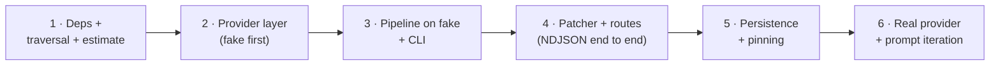

# 06 — Build Order

Six stages. Every stage ends runnable; the first five need no API key (fake provider).
Aligned with the parent plan's phases and the frontend's stage 6 swap.

## Stage 1 — Dependencies, schemas, traversal, estimate

1. Add the four deps (00); `app/walkthrough/` package skeleton.
2. `schemas.py` (parent 04 types as Pydantic).
3. `traversal.py` + the unit suite (05's traversal rows — the fixture project lands
   here too).
4. `routes.py` with **estimate only**; register the router.

✅ Checkpoint: `GET /walkthroughs/estimate` answers correctly for real project nodes;
traversal tests green. The frontend Launcher can already point at this.

## Stage 2 — Provider layer (shared, fake first)

1. `agent/llm/providers.py` + settings fields + boot validation (02).
2. `fake.py` with the failure knobs (05).
3. `factory.py` + `structured.py` with retry/fallback contract; unit tests using the
   fake's `fail_first_attempts`.

✅ Checkpoint: `structured_call` demonstrably does try → retry-with-error → give-up,
with zero network. Provider switching proven by pointing `custom` at a local echo.

## Stage 3 — Pipeline on fake + CLI

1. `context.py` (NodeContext prefetch via existing repos/services).
2. `prompts.py` (parent 07 verbatim) + `PROMPT_VERSION`.
3. `graph.py` (parent 05) + `fallbacks.py`; patcher/persist as injected no-ops.
4. `cli.py`; integration test: full run on the fixture project.

✅ Checkpoint: `uv run python -m app.walkthrough.cli <fixture-node> 2 --provider fake`
prints a complete, correctly-shaped tour. Deterministic: same input, same output.

## Stage 4 — Patcher + run route

1. `patcher.py` (helpers, mirror, seq, frame log) + unit tests.
2. `transport.py` + `service.py` (lock, lifecycle, abort) + `POST /run`.
3. Route integration tests: framing, 409, 422, disconnect.

✅ Checkpoint: `curl -N` shows hello/patch/end streaming on the fake provider. The
frontend's `httpSource` can integrate **now** — still no API key involved.

## Stage 5 — Persistence + commit pinning

1. `WalkthroughSessionSchema` doc type; `persistence.py`; incremental writes wired
   into service + patcher.
2. Capture branch/commit at run start; thread ref-scoped reads into traversal/context
   if the read path supports it (04's honest boundary if not).
3. `GET /walkthroughs/{id}`; crash-truthfulness test.

✅ Checkpoint: run → kill mid-run → doc says `aborted` with finished stops intact;
completed run replayable via GET.

## Stage 6 — Real provider + prompt iteration

1. Set `AI_GATEWAY_API_KEY` (or OpenAI key), flip nothing else — `vercel` is already
   the settings default (02).
2. CLI runs on real nodes with GLM 4.7 / Kimi 2.5; iterate prompts per parent 07,
   bumping `PROMPT_VERSION`; record validator first-pass rates from the logs.
3. `--frames` dumps become frontend fixtures (frontend stage 6 swap).
4. Stability pass: same node twice → same block structure (temperature 0.2 check).

✅ Checkpoint: the MVP demo — drop node in the real UI, real model, streamed tour,
session in TerminusDB.

## Definition of done (backend MVP)

- [ ] Estimate exact on nodes/order; over-cap returns a clean 422.
- [ ] Provider switch = one settings value; boot fails fast on bad config; `fake`
      runs a fresh checkout with no keys.
- [ ] No single LLM failure kills a run (proven by fake-failure integration tests);
      degraded steps flagged and logged.
- [ ] Stream always terminates with `end`; disconnect leaves an `aborted` session.
- [ ] Mirror == persisted doc == what the frontend reconstructs from frames (one
      round-trip test asserts all three).
- [ ] Session pinned to branch + commit at run start.
- [ ] CLI can produce a frontend fixture from any run.
