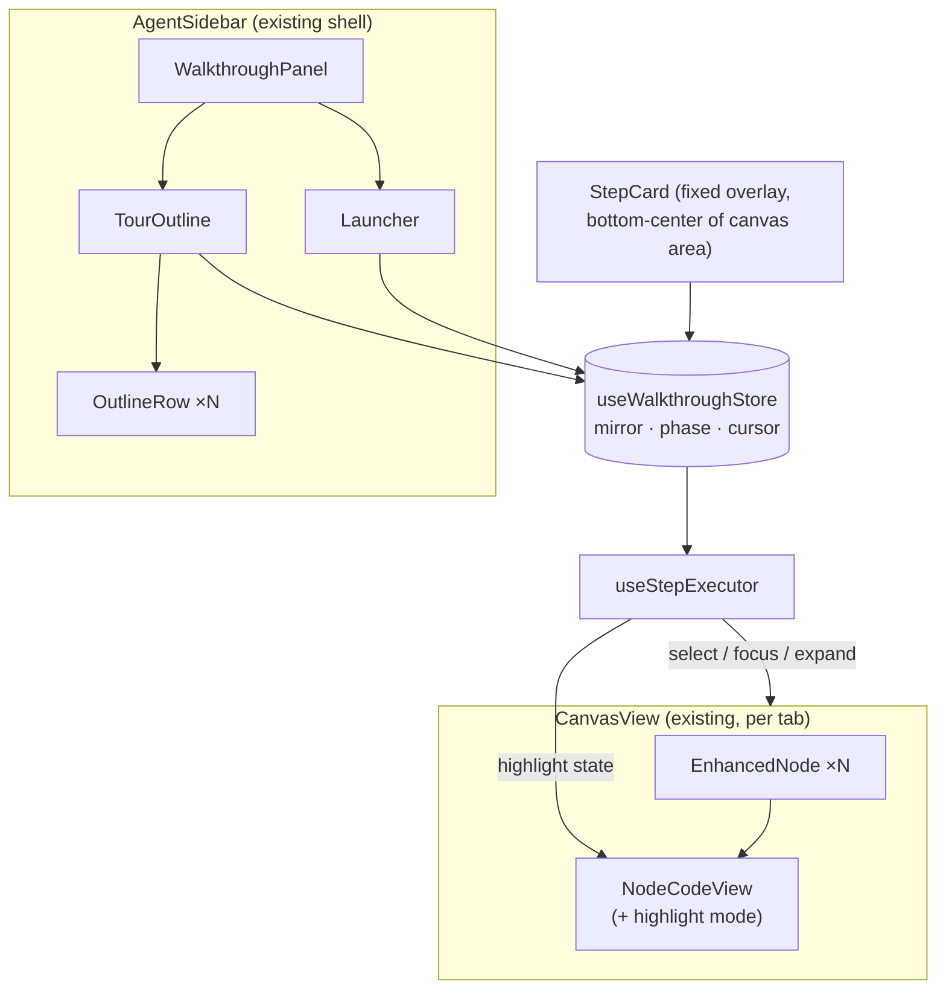

# 01 — Folder Structure

Where every new file goes, and the short list of existing files we touch. The
walkthrough is a **sub-feature of the existing Agent feature** — it inherits the
shell (sidebar, overlay, toggle) and adds a `walkthrough/` folder beside the
prototype code, which stays untouched.

## New files

```
src/frontend/src/features/Dashboard/features/Agent/
└── walkthrough/
    ├── index.tsx                      ← WalkthroughPanel: mounts inside AgentSidebar
    │
    ├── components/
    │   ├── Launcher.tsx               ← selected node + depth picker + estimate + Generate
    │   ├── TourOutline.tsx            ← stop rows (indent by level, ↳ for calls) + block sub-rows
    │   ├── OutlineRow.tsx             ← one row: name, state (pending/filled/⚠), click-to-jump
    │   ├── StepCard.tsx               ← fixed card: title, text, ⚠, counter, Prev/Next, Exit
    │   └── GeneratingShimmer.tsx      ← "generating…" state at the queue edge
    │
    ├── store/
    │   ├── useWalkthroughStore.ts     ← zustand store: mirror, phase, cursor (03)
    │   └── flatten.ts                 ← session.node_steps → PlayerStep[] (pure, tested)
    │
    ├── source/
    │   ├── types.ts                   ← WalkthroughSource interface + frame types (02)
    │   ├── mockSource.ts              ← replays a fixture patch log with delays
    │   ├── httpSource.ts              ← POST /run, reads NDJSON stream
    │   ├── applyFrame.ts              ← hello/patch/end → store (uses fast-json-patch)
    │   └── index.ts                   ← pickSource(): mock | http (dev switch)
    │
    ├── executor/
    │   ├── useStepExecutor.ts         ← reacts to cursor change; runs the actions
    │   ├── ensureOnCanvas.ts          ← the node-injection query wrapper (04)
    │   └── restoreView.ts             ← snapshot & restore focus/selection on exit (05)
    │
    ├── fixtures/
    │   ├── smallFunction.json         ← recorded patch log: 1 function, 3 blocks
    │   └── classWithCall.json         ← class + methods + call into another file
    │
    └── types.ts                       ← mirrors backend schemas (VisitNode, NodeSteps,
                                          PlayerStep, frames) + zod parsers
```

Naming follows the folder's own convention (`useX` hooks, PascalCase components,
feature-local `store/`, `fixtures/` beside code — the Agent feature already does all
of this).

## Existing files we touch (keep this list short on purpose)

| File | Change |
|---|---|
| `Agent/index.tsx` / `AgentSidebar.tsx` | Mount `WalkthroughPanel` (walkthrough view mode already exists as `ViewMode = "chat" \| "walkthrough"`) |
| `Canvas/components/nodes/NodeCodeView.tsx` (+ `useNodeCode`) | Accept walkthrough highlight state: decorations, dimming, reveal (04). Read-only mode while a tour plays |
| `Canvas/components/CanvasView.tsx` | Expose the ReactFlow instance to the executor (a ref in the walkthrough store or a small registry keyed by `tabId`); `onMoveStart` sets `userInteracted` |
| `package.json` | add `fast-json-patch` |

Nothing else. Specifically **not touched**: `useTabStore`, `useProjectStore` slices
(the executor calls their existing actions), the Agent prototype (`ReplayRunner`,
`useReplayStore`, `conversations.ts` fixtures).

## Component tree at runtime



One store, one executor, everything else renders from the store. The StepCard is a
sibling of the canvas (fixed overlay), not a child of any node — it must survive
nodes mounting/unmounting as the tour moves.
