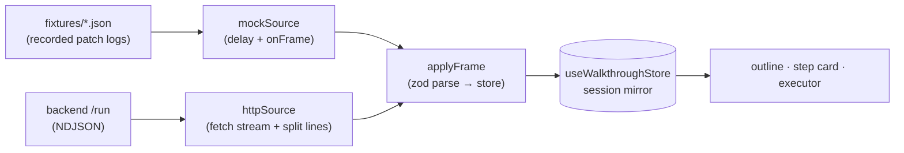

# 02 — Wire and Mock

How frames reach the store, and how the whole frontend runs on fixture JSON until the
backend exists. The design goal: **the swap to the real backend changes one line.**

## The frame types (mirror of parent 04)

```typescript
type Frame =
  | { kind: "hello"; protocol: 1; session: WalkthroughSession }
  | { kind: "patch"; seq: number; ops: Operation[] }     // RFC 6902, fast-json-patch's type
  | { kind: "end"; status: "complete" | "error"; message?: string };
```

Zod-parse every frame at the boundary (`types.ts`). A frame that fails parsing is
logged and dropped; the stream continues — same policy as Eregna's widget.

## The source interface

```typescript
interface WalkthroughSource {
  run(req: RunRequest, onFrame: (f: Frame) => void, signal: AbortSignal): Promise<void>;
  estimate(req: RunRequest): Promise<Estimate>;
}
```

Two implementations, chosen once at startup:

```typescript
// source/index.ts
export const source: WalkthroughSource =
  import.meta.env.VITE_WALKTHROUGH_MOCK === "1" ? mockSource : httpSource;
```

That env flag is the entire mock/backend swap. Components, store, and executor import
`source` and never know which one they got.

## MockSource — a recorded patch log with delays

A fixture **is** a patch log: the same frames the backend would send, saved as JSON.

```json
{
  "estimate": { "node_count": 4, "step_estimate": 9, "llm_call_estimate": 8, "over_cap": false },
  "frames": [
    { "delay": 0,   "frame": { "kind": "hello", "protocol": 1, "session": { "...": "..." } } },
    { "delay": 600, "frame": { "kind": "patch", "seq": 0, "ops": [ { "op": "replace", "path": "/node_steps/0/intro_text", "value": "..." } ] } },
    { "delay": 900, "frame": { "kind": "patch", "seq": 1, "ops": [ { "op": "add", "path": "/node_steps/0/blocks/-", "value": { "...": "..." } } ] } },
    { "delay": 100, "frame": { "kind": "end", "status": "complete" } }
  ]
}
```

`mockSource.run` walks `frames`, awaiting `delay` ms before each `onFrame` (abortable
via the signal). The delays simulate LLM latency, so the skeleton-fills-in UX and the
play-while-generating path are exercised realistically — not just the final state.

Two fixtures to hand-write (against a real project's node ids, so the canvas actions
work on real data):

1. `smallFunction.json` — one function, three blocks. The smallest complete tour.
2. `classWithCall.json` — a class stop, two method stops, one call stop whose node
   lives in **another file** (exercises the injection query), and one **contextual**
   stop (duplicate call). This is the fixture that proves the hard paths.

Hand-writing fixture #2 is deliberately part of the plan: if the fixture is painful to
write, the types are wrong — cheaper to learn that now than after the backend exists.

**Fixture drift guard:** fixtures are zod-parsed by the same `types.ts` parsers as
live frames, in a unit test. When the schema changes, the test fails, the fixture gets
updated — fixtures can't silently rot.

## HttpSource — the real stream

```typescript
// httpSource.run — ~25 lines, no library (same as Eregna's runStream)
const res = await fetch(`/api/walkthroughs/run`, { method: "POST", body: JSON.stringify(req), signal });
const reader = res.body.pipeThrough(new TextDecoderStream()).getReader();
// buffer by "\n", JSON.parse each line, zod-parse, onFrame(frame)
```

`fetch` + `ReadableStream`, not `EventSource` — the run is a POST with a body, and
NDJSON-over-POST is what the backend emits (parent 04). Abort propagates through the
`signal` to cancel generation server-side.

`estimate` is a plain GET via the existing react-query setup.

## applyFrame — frames into the store

```
hello  → store.setSession(frame.session)            phase: "generating"
patch  → store.applyOps(frame.ops)                  (fast-json-patch applyOperation
                                                     over an immer draft of session;
                                                     track lastSeq, log gaps)
end    → phase: "ready" | "error"
```

One reducer path for everything. There is deliberately no per-field handling — if the
backend adds a field to the session tomorrow, the mirror carries it with zero frontend
changes until some component wants to render it.

## Data flow picture



## Recording future fixtures

Once the backend exists, fixtures stop being hand-written: the backend already keeps
the frame log (patcher log, parent 04), so "save this run as a fixture" is dumping
that log with delays filled from real timestamps. Mock mode then doubles as offline
demo mode and regression harness for the player.
