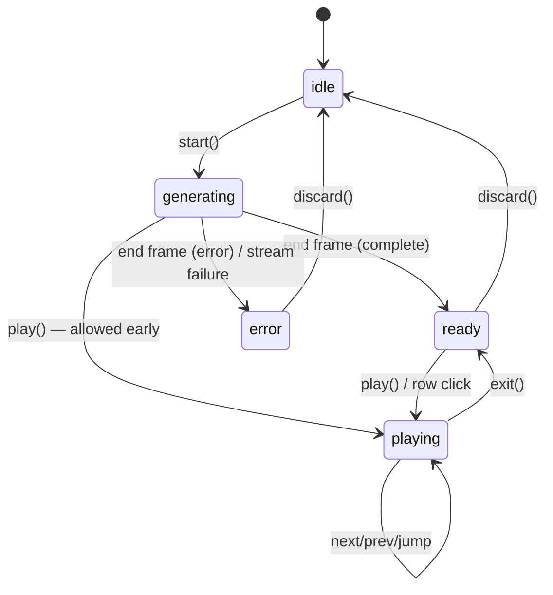

# 03 — Store and Player

The single store, the flattening rule, and every way the user moves through steps.

## Store shape

```typescript
interface WalkthroughState {
  // lifecycle
  phase: "idle" | "generating" | "ready" | "playing" | "error";
  error: string | null;

  // the mirror (02) — hello sets it, patches mutate it
  session: WalkthroughSession | null;
  lastSeq: number;

  // playback
  tabId: string | null;            // the tab the tour was started from (usually root)
  cursor: number;                  // index into playerSteps; -1 = not started
  userInteracted: boolean;         // user panned/zoomed since the step began (04/05)
  savedView: SavedView | null;     // focus/selection snapshot for restore-on-exit (05)

  // actions
  start(req: RunRequest): void;    // calls source.run, wires applyFrame, sets tabId
  applyOps(ops: Operation[]): void;
  play(): void;                    // phase → playing, cursor → 0 (or keep position)
  exit(): void;                    // restore view, clear highlight, phase → ready
  next(): void; prev(): void;
  jumpTo(stepId: string): void;
  discard(): void;                 // full reset to idle (confirm in UI)
}
```

One zustand store (with immer), feature-local like the Agent prototype's stores. Not
a `useProjectStore` slice: the tour is a mode that *drives* project state, it isn't
project state.

## Flattening: mirror → PlayerStep[]

`flatten.ts` derives the executable step list from `session.node_steps` (memoized on
the mirror version). The rule is fixed (parent 04):

```
container / contextual stop → [ select ]                          (intro text)
full code stop              → [ select ]                          (intro text)
                              [ show_code + highlight(block 0) ]  (block 0 text)
                              [ highlight(block 1) ]              (block 1 text)
                              ...
```

Key property: **flatten is stable under growth.** Patches only append node_steps and
blocks or fill texts in place, so existing `PlayerStep` ids ("n03", "n03.b1") never
change while generating — the cursor can't be invalidated by an incoming frame.

## How the user selects steps (all of them)

| Input | Behavior |
|---|---|
| **Next / Prev buttons** on the StepCard | `cursor ± 1`; Next past the last *available* step shows the shimmer, auto-advances when the step's text patch arrives |
| **Arrow keys** (← →) while a tour is playing | Same as buttons. Registered only in `phase === "playing"`, removed on exit — never steal keys from the editor otherwise |
| **Outline row click** | `jumpTo(firstStepOf(stop))` — also enters `playing` from `ready` |
| **Block sub-row click** | `jumpTo("nNN.bK")` |
| **StepCard counter** ("7 / 21") | display only in MVP |
| **Esc / ✕** | `exit()` — restore view (05), keep the session; Play resumes at the same cursor |

Prev is free because steps are **re-executable descriptions**: executing step N always
produces the correct canvas state regardless of what happened before (select + ensure
+ expand + highlight are all idempotent).

## Phase machine



The one subtlety, same as the parent plan: `playing` during `generating` is legal.
The player consumes whatever `flatten` has produced; the shimmer covers the gap at
the queue edge.

## StepCard (the fixed card)

```
┌────────────────────────────────────────────────┐
│ validate the card fields              ⚠  3/9   │   title = node name or block focus
│ The function first checks the card number      │   body = step text
│ and expiry so bad input fails fast …           │
│                                                │
│  [✕ Exit]                    [◀ Prev] [Next ▶] │
└────────────────────────────────────────────────┘
```

- Fixed position bottom-center of the canvas area (the existing `AgentBottomBar`
  pattern/slot). It never anchors to nodes or lines in MVP.
- Renders straight from `playerSteps[cursor]`; `degraded` shows the ⚠ with a
  "fallback text" tooltip.
- While the current step's text is still empty (patch not arrived), the card body is
  the `GeneratingShimmer`.

## TourOutline

- Renders from `session.visit_list` immediately after `hello` — full skeleton before
  any LLM output.
- Row states: pending (grey) → filled (normal, when intro text lands) → done
  (✓ via block texts complete) → degraded (⚠). Current stop gets an accent bar;
  auto-scrolls into view as the cursor moves.
- Indent by `level`; call stops prefixed `↳`; contextual stops rendered with a link
  glyph to their `first_seen_order` row (click = jump there).
