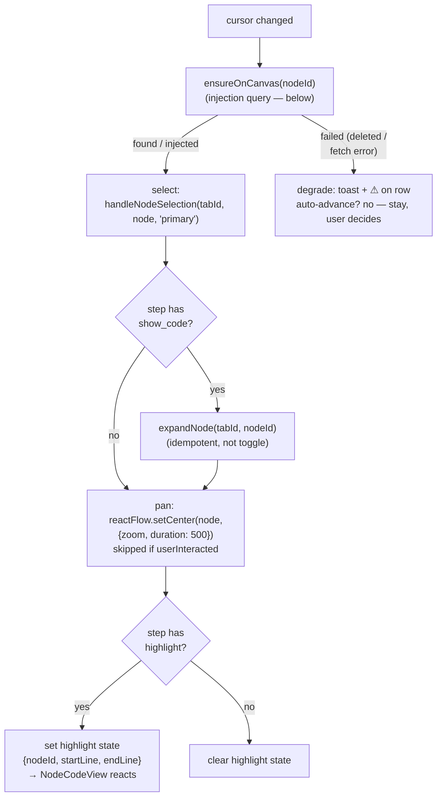

# 04 — Canvas Integration

How the three actions land on the real canvas, including the **node-injection query**
for nodes that aren't loaded yet, and the Monaco highlight mode.

## The executor

`useStepExecutor` reacts to `cursor` changes. For the current step it runs one fixed
sequence — every stage idempotent, so re-running a step (Prev, jump) is safe:



Order matters: inject → select → expand → pan → highlight. Panning happens *after*
expansion because expanding changes the node's size (the layout hook reflows), and we
want to center on the expanded node.

## ensureOnCanvas — the node-injection query

A step's `nodeId` may not be on the canvas at all: children are **lazy-loaded and
paginated** (`lazy_child_ids`, `codeDescendants` service), and call stops may target
nodes in files that were never opened. The codebase already solved this exact problem
for call-portal tabs in `useTabStore.handleNodeSelection`; we wrap the same machinery:

```
ensureOnCanvas(tabId, nodeId):
  1. node = findNodeByIdWithDescendantCache(projectData, nodeId)
     └─ found → return it                        (fast path, most steps)
  2. { path_ids } = codeApi.getLineage(projectKey, nodeId)
     └─ the graph answers "how do I reach this node from the root"
  3. lineage = resolveLineageFromPath(queryClient, projectData, projectKey, path_ids)
     └─ fetches every missing ancestor along the path — this is what pages
        through lazy children; results land in the react-query cache
  4. clearFocus(tabId) → pushFocusBulk(tabId, lineage)
     → expandNodesBulk(tabId, lineage.map(id))
     └─ canvas now renders the branch; the node exists as a ReactFlow node
  5. return lineage.at(-1)
```

Notes:

- Steps 2–4 are **exactly** what the call-portal flow already does (see
  `useTabStore.handleNodeSelection`) — `ensureOnCanvas.ts` extracts it into a shared
  helper instead of copying it. That extraction is the only refactor this plan asks
  for.
- Results are cached twice over: react-query caches the lineage fetches, and step 1
  hits for every revisit (Prev/jump). A tour that walks forward loads each branch
  once.
- **Focus semantics:** replacing the focus stack with the step's lineage is correct
  for the tour ("show me where this lives"), and the pre-tour view is restored on
  exit (05) — so we don't try to be clever about merging with the user's focus.
- Failure (deleted node, network error) returns null → the executor degrades: toast,
  ⚠ on the outline row, cursor stays put. The user can Next past it.

## select_node and show_code

Thin calls into what exists:

- **select** → `handleNodeSelection(tabId, node, "primary")` — the same path a user
  click takes, so selection ring, right-sidebar sync, and call-portal side effects
  stay consistent. (For `call` stops we select the call node itself — its portal-tab
  side effect is acceptable and matches user expectations; if it proves noisy, pass a
  flag to suppress portal creation. Decide in dogfooding.)
- **expand** → `expandNode(tabId, nodeId)` (idempotent) — never `toggleNodeExpansion`,
  which would collapse on re-execution (Prev).
- **pan** → the ReactFlow instance for the tour's tab, registered in a tiny
  `canvasRegistry` (Map<tabId, ReactFlowInstance>) that `CanvasView` populates on
  init. `setCenter(x, y, {zoom, duration})` with the node's measured center — the
  `useCanvasNavigator` sketch from the old cognitive-replay plan, finally built.

## highlight_lines — Monaco walkthrough mode

`NodeCodeView` (which renders the `CodeEditor` Monaco instance per expanded node)
gains a highlight mode driven by store state:

```typescript
const highlight = useWalkthroughStore(s =>
  s.phase === "playing" && s.playerSteps[s.cursor]?.nodeId === nodeId
    ? currentHighlight(s)        // {startLine, endLine} | null
    : null
);
```

- **Decorations**: one `deltaDecorations` call per change — full-line class
  `.walkthrough-line` (background + left border via CSS variables so themes hold) on
  the block range, `.walkthrough-dim` (reduced opacity) on the rest. Store the
  decoration ids in a ref; always replace, never accumulate; clear on unmount and on
  `exit()`.
- **Line mapping**: block ranges are absolute file lines; the node's editor shows the
  node's slice. `editorLine = absLine − node.start_line + 1`, computed in **one**
  exported function with unit tests — the only line-number translation in the system.
- **Reveal**: `revealLinesInCenterIfOutsideViewport(start, end)` on highlight change.
- **Editor readiness**: the Monaco instance mounts async (`onMount`) and code arrives
  via react-query (`useNodeCode` fetches when `showCode` flips). The highlight effect
  therefore waits on `editorReady && codeLoaded`; if the code query errors, degrade
  (⚠, text still shown in the StepCard — the explanation survives without the visual).
- **Read-only while playing**: the editor's edit/save affordances are suppressed in
  walkthrough mode to keep "tour" and "edit" modes from fighting.

## User interaction during a step

`CanvasView.onMoveStart` (user-initiated pan/zoom) sets `userInteracted = true`; the
executor then skips its `setCenter` until the next cursor change (which resets the
flag). Selection clicks during a tour are allowed — the next step simply re-selects.
The tour never locks the canvas; it only stops fighting the user.
