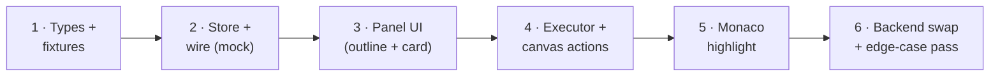

# 06 — Build Order

Six stages. Every stage ends with something you can click, running entirely on mock
fixtures until the last one. No stage reworks a previous one.

## Stage 1 — Types and fixtures (no UI)

1. `yarn add fast-json-patch`.
2. `walkthrough/types.ts`: session/step/frame types + zod parsers (mirror parent 04).
3. Hand-write `fixtures/smallFunction.json` against a real project's node ids.
4. Unit test: every fixture frame zod-parses; applying all patches to the hello
   session yields a complete session (no dangling paths).

✅ Checkpoint: `vitest` green. If writing the fixture hurt, fix the types now.

## Stage 2 — Store + wire, mock only

1. `useWalkthroughStore` with `applyOps` (fast-json-patch over immer draft).
2. `flatten.ts` + tests: stable ids, growth-safe, container/contextual/code shapes.
3. `mockSource` (delays + abort) and `applyFrame`; `pickSource` env switch.
4. Wire `start()` end-to-end: store fills over ~seconds, visible in devtools.

✅ Checkpoint: dispatch `start()` from a debug button; watch the mirror grow in
zustand devtools; `playerSteps` lengthens as frames land.

## Stage 3 — Panel UI

1. Mount `WalkthroughPanel` in the Agent sidebar's walkthrough view mode.
2. `Launcher`: selected-node display ("Use selected: `charge()`"), depth picker,
   estimate from `source.estimate`, Generate button (+ confirm-discard, edge #15).
3. `TourOutline` + `OutlineRow`: skeleton from hello, fill/⚠/✓ states, indent + ↳.
4. `StepCard` fixed overlay: title/text/shimmer/⚠/counter, Prev/Next/Exit buttons,
   arrow keys (edge #17). Cursor moves — no canvas effects yet.

✅ Checkpoint: full "generation" and click-through of text on mock data — the tour
reads correctly before it moves anything.

## Stage 4 — Executor + canvas actions

1. Extract the lineage flow from `useTabStore.handleNodeSelection` into
   `ensureOnCanvas.ts` (the one refactor); re-point the tab store to it; verify call
   portals still work.
2. `canvasRegistry` (tabId → ReactFlow instance) populated by `CanvasView`.
3. `useStepExecutor`: inject → select → expand → pan, `userInteracted` via
   `onMoveStart` (edges #3, #4, #6, #7).
4. `SavedView` snapshot/restore + tab/view switching on play (edges #1, #2, #10, #11).
5. Switch dev testing to `classWithCall.json` — the fixture with a cross-file call
   and a contextual stop.

✅ Checkpoint: mock tour drives the real canvas — pans, selects, expands, pages in a
never-loaded branch — and Exit puts the workspace back exactly.

## Stage 5 — Monaco highlight

1. Highlight state in `NodeCodeView`: decorations + dim, replace-not-accumulate,
   clear on exit/unmount.
2. The line-mapping function + unit tests (absolute ↔ editor lines).
3. Readiness gating + timeout degrade (edge #12), range clamp (edge #13),
   read-only-while-playing.
4. CSS: `.walkthrough-line`, `.walkthrough-dim` on theme variables.

✅ Checkpoint: the full MVP experience on mock data — this is the demo build, and it
works offline.

## Stage 6 — Backend swap + edge-case pass

1. `httpSource` (fetch stream, line splitting, abort) — ~25 lines.
2. Flip `VITE_WALKTHROUGH_MOCK=0`; run against the real backend (backend phases 1–4
   of the parent plan).
3. Walk the 05 table top to bottom as a manual test script; fix what's red.
4. Record one real run's frame log as a third fixture (drift guard for the future).

✅ Checkpoint: same UI, real agent. The mock switch stays forever — it's the offline
demo and the player's regression harness.

## Definition of done (frontend MVP)

- [ ] Both fixtures play end to end: text, canvas motion, highlights, contextual stop.
- [ ] Node never loaded before → injected and toured (watch the network tab page
      through descendants).
- [ ] Exit always restores: focus stack, selection, expansions, viewport, tab view.
- [ ] Play from another tab / from Code view lands on the tour's canvas (and back).
- [ ] Kill the mock mid-stream: generated steps playable, Regenerate offered.
- [ ] No canvas fighting: pan during a step, click other nodes — tour yields.
- [ ] `VITE_WALKTHROUGH_MOCK` flips between mock and backend with no other change.
