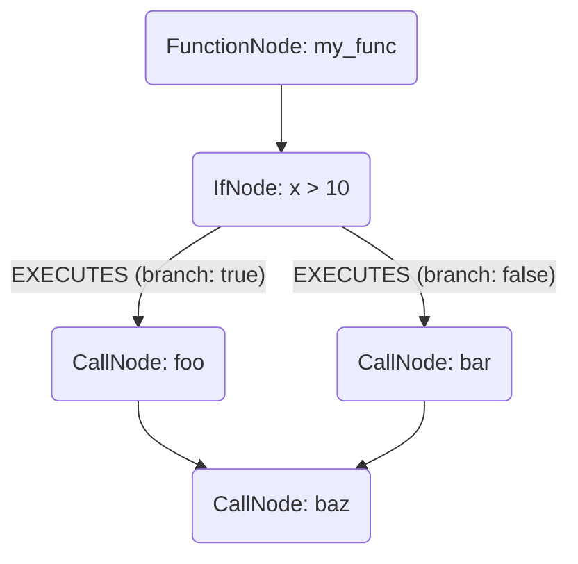

# Control Flow Analysis Design

This document details the plan to extend the parser to analyze and model control flow structures (`if`, `match`, `for`, `while`). This updated design uses a true **Control Flow Graph (CFG)** or "Execution Graph" model, which is simpler and more powerful than the previous `BRANCHES` edge design.

## Core Principle: An Execution Graph

Instead of connecting blocks with a generic `BRANCHES` edge, we will use a single, directed `EXECUTES` edge to represent the actual flow of execution. This creates a clear, queryable graph of how a program runs.

## 1. Schema Extensions

### Node Types (Unchanged)
We will still create nodes for control flow blocks, but they will be simpler:
-   `IfNode`
-   `ForLoopNode`
-   `WhileLoopNode`
-   `MatchNode`
-   `CaseNode`
-   We will also now create a `CallNode` for each function call, to serve as a node in the execution graph.

### New Edge Type: `EXECUTES`
This is the most important change. We will add one new edge type to `edges.py`.

-   **`EXECUTES`**: A directed edge representing the unconditional next step in execution.
    -   `_from`: Any node in the execution graph (a `FunctionNode`, `IfNode`, `CallNode`, etc.).
    -   `_to`: The very next node in the execution sequence.
    -   `branch`: An optional string property, either `"true"` or `"false"`, used only on the two outgoing edges from an `IfNode`.

## 2. Visualizing the Execution Graph

Consider this code:
```python
def my_func(x):
    if x > 10:
        foo()
    else:
        bar()
    baz()
```

The graph structure becomes a clear, directed flow:


This is much cleaner and more powerful than the previous design.

## 3. The `ControlFlowVisitor`

The visitor's job is now to build this execution graph.

### `visit_If(self, node: ast.If)`
-   **Logic:**
    1.  Create the `IfNode`.
    2.  Link the previous statement (the "cursor") to this `IfNode` with an `EXECUTES` edge.
    3.  Recursively visit the `body` block, passing the `IfNode` as the new cursor. The first statement in the `body` will be linked from the `IfNode` with an `EXECUTES` edge where `branch="true"`.
    4.  Keep track of the last statement in the `body` block.
    5.  Recursively visit the `orelse` block, passing the `IfNode` as the cursor. The first statement in the `orelse` block will be linked from the `IfNode` with an `EXECUTES` edge where `branch="false"`.
    6.  Keep track of the last statement in the `orelse` block.
    7.  The new "cursor" for subsequent statements will be the set of all statements that were the last in their respective blocks (e.g., the `foo()` and `bar()` call nodes in the example).

### `visit_For(self, node: ast.For)`
-   **Logic:**
    1.  Create the `ForLoopNode`.
    2.  Link the previous statement to this `ForLoopNode`.
    3.  Recursively visit the `body`, linking the `ForLoopNode` to the first statement in the body.
    4.  The last statement in the `body` gets an `EXECUTES` edge pointing back to the `ForLoopNode`, creating the loop.
    5.  The `ForLoopNode` itself becomes the new cursor for the statement that follows the loop.

## 4. Impact on Other Components
-   **`CallVisitor` is removed:** We no longer need a separate `CallVisitor`. The `ControlFlowVisitor` will now be responsible for creating `CallNode`s as it encounters them in the execution graph. This further simplifies the pipeline.
-   **Schema:** The schema is simpler, requiring only one new `EXECUTES` edge instead of multiple complex ones.

This updated design is a significant improvement. It's easier to implement, less prone to errors, and produces a graph that is a true, queryable representation of the program's execution paths.
