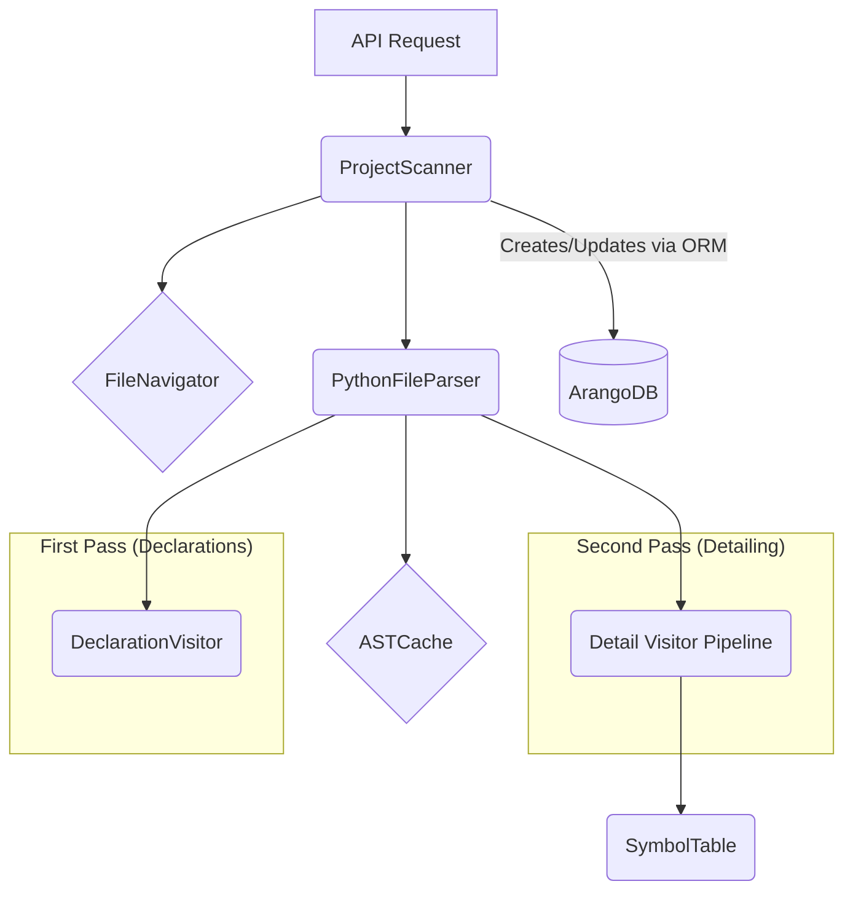

# Parser Architecture

This document outlines the architecture for the Python codebase parser, which is designed to integrate with the project's existing ArangoDB ORM. The architecture is heavily inspired by a two-pass analysis system, which is essential for accurately resolving symbols in Python.

## Core Philosophy

The parser will not interact directly with the database. Its sole responsibility is to produce Pydantic models (`Node` and `Edge` objects from `app.models`). The existing `db.collections` ORM layer will be used by a higher-level service to commit these objects to the database. This keeps the parsing logic clean and decoupled from database concerns.

## The Two-Pass Analysis Strategy

1.  **First Pass (Declaration):** The parser will make a quick pass over every Python file in the project. The goal of this pass is to identify and create nodes for every high-level declaration: projects, folders, files, classes, functions, and packages. These are created first so they have a database `_id` that can be referenced in the second pass.
2.  **Second Pass (Linking):** The parser will then make a second, more detailed pass. With all the declared nodes already existing, this pass can focus on creating the edges that link them together: `CALLS`, `IMPORTS`, `CONTAINS`, etc. This is where the complex work of resolving call targets and dependencies happens.

## Component Breakdown

1.  **`FileNavigator` (`core/parser/file_navigator.py`)**
    *   **Responsibility:** File discovery.
    *   **Function:** Scans a project directory and finds all `.py` files. This component already exists and will be used as-is.

2.  **`ASTCache` (`core/parser/python/ast_cache.py`)**
    *   **Responsibility:** Caching parsed ASTs.
    *   **Function:** A simple in-memory dictionary to store the `ast.Module` object for each file. This prevents the system from having to read and parse the same file twice (once for each pass).

3.  **Visitors (`core/parser/python/visitors/`)**
    *   **Responsibility:** AST traversal and raw data extraction.
    *   **`DeclarationVisitor`:** Performs the first pass. It finds all `ast.ClassDef` and `ast.FunctionDef` nodes.
    *   **`DetailVisitor` (Pipeline):** Performs the second pass through a series of single-purpose visitors (Control Flow, Dependencies, etc.).
    *   **[► Read Detailed Design](./visitors/README.md)**

4.  **`SymbolTable` (`core/parser/python/symbol_table.py`)**
    *   **Responsibility:** The "brain" of the parser. It tracks all symbols, their scopes, and their corresponding database `_id`s.
    *   **Function:** It provides the critical resolution logic. When a visitor finds a call like `u.foo()`, the `SymbolTable` is responsible for figuring out that `u` is an alias for `utils.py` and that the target is the `foo` function within that file. It then provides the database `_id` for that function so an edge can be created.
    *   **[► Read Detailed Design](./python/SYMBOL_TABLE_DESIGN.md)**

5.  **`PythonFileParser` (`core/parser/python/file_parser.py`)**
    *   **Responsibility:** Orchestrates the parsing of a single file.
    *   **Function:** This class will contain the logic for both the first and second passes for a given file. It will use the appropriate visitor and the `SymbolTable` to produce lists of Pydantic node and edge objects. It does **not** save them to the database.
    *   **[► Read Detailed Design](./python/FILE_PARSER_DESIGN.md)**

6.  **`ProjectScanner` (`services/scanner.py`)**
    *   **Responsibility:** The main entry point and orchestrator for parsing a whole project.
    *   **Function:**
        1.  Initializes the `SymbolTable` and `ASTCache`.
        2.  Uses `FileNavigator` to get all file paths.
        3.  Creates the initial `ProjectNode` and `FileNode` objects and saves them using the ORM.
        4.  **First Pass:** Iterates through each file and calls the `file_parser.run_declaration_pass()`. It collects all the generated Pydantic `Node` objects and saves them to the database using the ORM.
        5.  **Second Pass:** Iterates through each file again and calls `file_parser.run_detail_pass()`. It collects all the generated Pydantic `Edge` objects and saves them to the database.

## Data Flow

`ProjectScanner` -> `FileNavigator` (get files)
`ProjectScanner` -> (Loop 1) -> `PythonFileParser.declaration_pass()` -> `DeclarationVisitor` -> (produces `Node` models) -> `db.collections.nodes.create()`
`ProjectScanner` -> (Loop 2) -> `PythonFileParser.detail_pass()` -> `DetailVisitor` + `SymbolTable` -> (produces `Edge` models) -> `db.collections.edges.create()`
